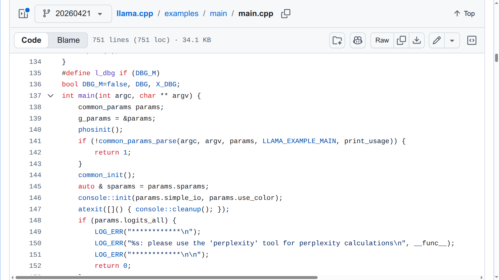
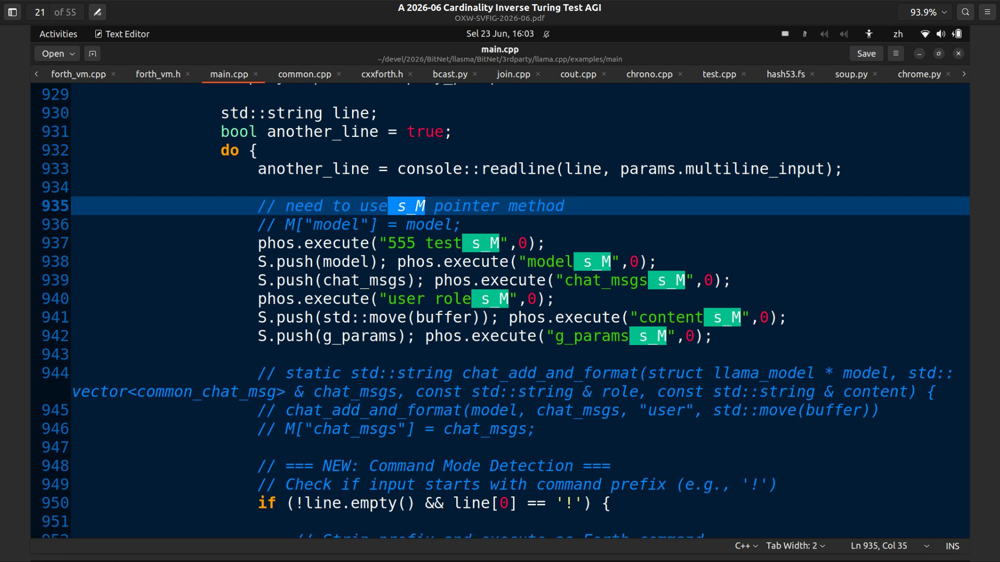

https://github.com/llasma/llama.cpp/blob/20260421/CHANGES/README.md

Update with PhosVM

以下是根据 https://github.com/llasma/llama.cpp/blob/20260421/CHANGES/README.md 网页内容翻译的中文版本：

---

URL: https://github.com/llasma/llama.cpp/blob/20260421/CHANGES/README.md

[跳转到内容](https://github.com#start-of-content) ## 导航菜单 {{ message }} # README.md # README.md ## 文件元数据与控件 137 行（85 行代码）· 4.23 KB

# LLASMA：Large Language + Stack Machine Architecture
大语言模型 + 栈式机器架构 = 大语言栈式架构

- A. 引言
- B. 我们如何编码
- C. 安装-运行-测试-贡献
- D. 理论与愿景

## A. 引言

纯 C/C++ 实现的 LLM 推理，内嵌 cxxforth + Phoscript 栈式机器 + 微软 BitNet 支持

LLASMA 是 [llama.cpp](https://github.com/ggerganov/llama.cpp)（基于 20260421 分支）的一个专用分支，它将以下两个受信任的基于 Forth 的栈式机器直接集成到推理循环中:
- A. [cxxforth](https://github.com/kristopherjohnson/cxxforth) 
- B. [PhosVM](https://github.com/llasma/llama.cpp/blob/20260421/common/forth_vm.h)

目标是创建 LLASMA 智能体：一种在以下两者之间保持清晰区分的系统：

- **不可信的概率知识**（来自 LLM），以及
- **可信的可执行技能**（在栈式机器中实现为可靠的 Forth 词 / Phoscript 原语）。

## B. 我们如何编码

LLASMA 的理论和愿景宏大，无法在一段话内讲完——我们相信这是自 ChatGPT 本身以来最重要的突破——因此我们将其放在最后，先满足急切的**编码者**——不废话。

图 1 - FORTH/Phoscript shell 的“入口点”如上图 1 所示，大约在第 843 行，`main.cpp` 等待用户输入。

图 2 - 如图 2 所示，`CMakeLists.txt` 第 53 行的 `add_library` 指令从第 71 行到第 74 行包含了 FORTH 相关文件：`cxxforth.h` `cxxforth.cpp` `forth_vm.h` `forth_vm.cpp`。

图 3 图 4 图 5 图 6 似乎出现了幻觉！但现在我们可以使用内部 FORTH Phoscript shell 来调查这种幻觉！！

## C. 安装

图 7 软链接 BitNet/models

## D. 理论与愿景

- **Omnihash 合约** —— 一种新型的自由软件许可证，新增了关于**披露与版税分离**的条款：其他方可以为非商业目的（包括研究）检查并测试代码（**披露**），但**必须**为商业运营（包括政府资助的活动）向所有者支付约定费用（**版税**）。

## 哲学

- 从一个微小的、可审计的核心栈操作原语（`DUP`、`SWAP`、`DROP`、`+`、`@`、`!`、`:`、`;` 等）开始。
- 使用 LLM 以 Forth 语法提出新技能。
- 验证并将安全的提案提升到受信任字典中。
- 这为智能体提供了增量式、可验证的技能获取，同时保持执行的可确定性和可沙箱化。

这种方法符合可靠的智能体设计：栈式机器是“执行者”，LLM 是“思考者/知识者”。

## 主要特性

- 完整的 llama.cpp 兼容性（LLaMA、LLaMA 2/3、Mistral、Mixtral、BitNet b1.58 及许多其他模型）
- 内嵌 cxxforth 栈式机器作为技能引擎
- 微软 BitNet（1.58-bit）模型支持，实现极致效率
- 所有标准后端：CUDA、Metal、Vulkan、SYCL、hipBLAS、BLAS 等
- 安全的技能获取管道（LLM 提案 → 验证 → 注册）
- 通过 `CHANGES/` 目录清晰追踪变更
- 最小依赖，高性能，可在从笔记本电脑到服务器的各种设备上运行

## 快速开始

### 1. 克隆（包含子模块，用于 cxxforth）

```bash
git clone --recursive https://github.com/llasma/llama.cpp.git
cd llama.cpp
git checkout 20260421  # LLASMA 2026-04-21（420 的后一天！！）
```

你此时无法执行该操作。

https://github.com/llasma/llama.cpp/blob/20260421/examples/main/main.cpp



