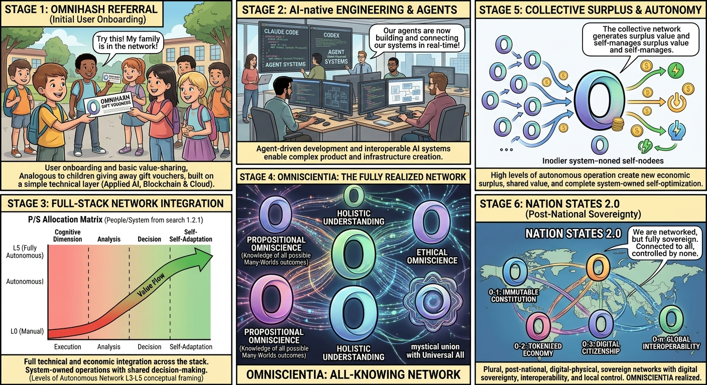
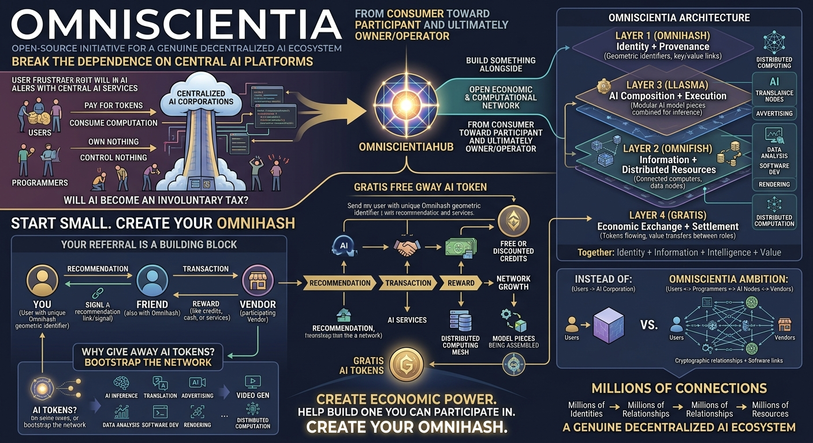
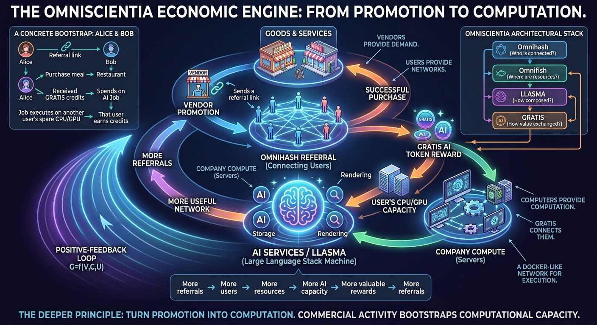
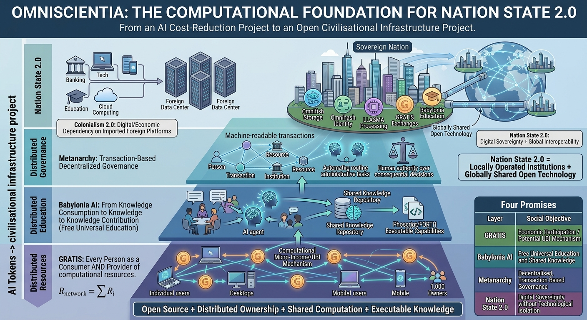
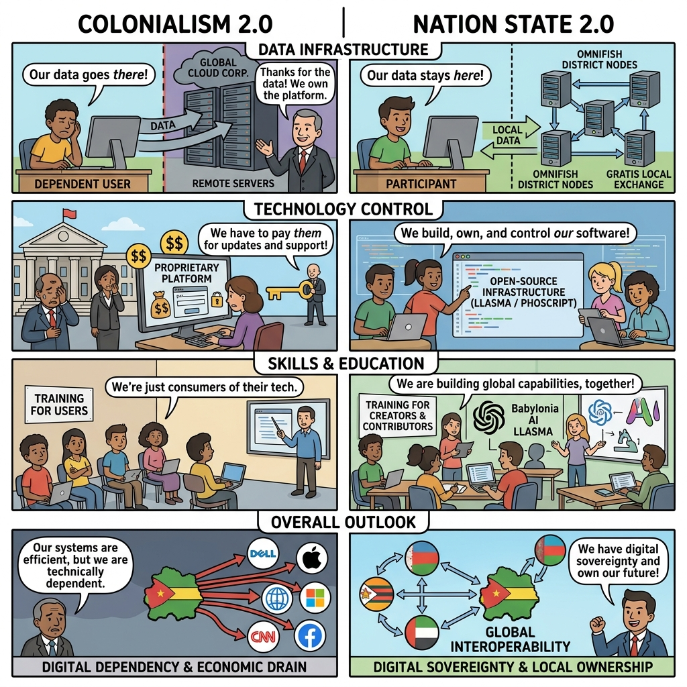
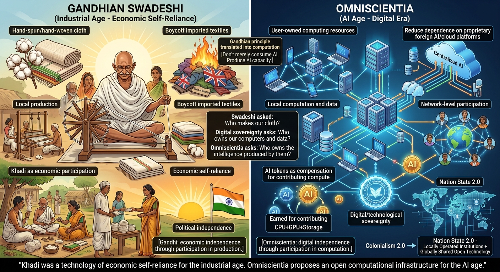
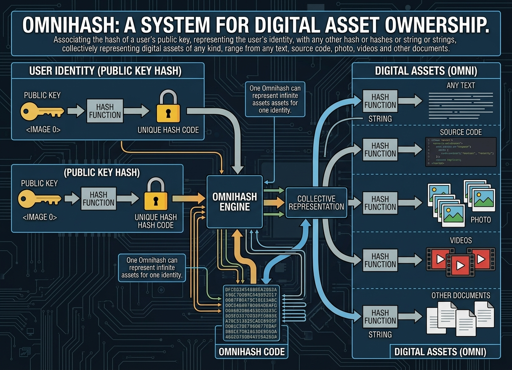
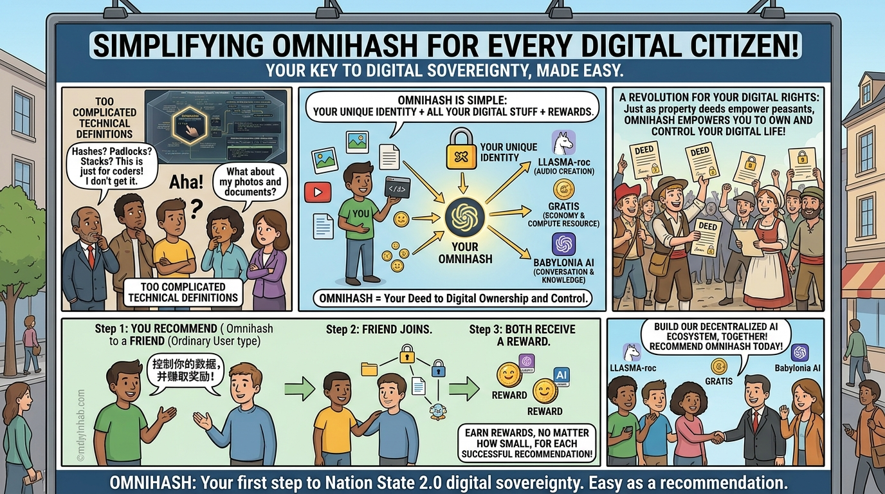
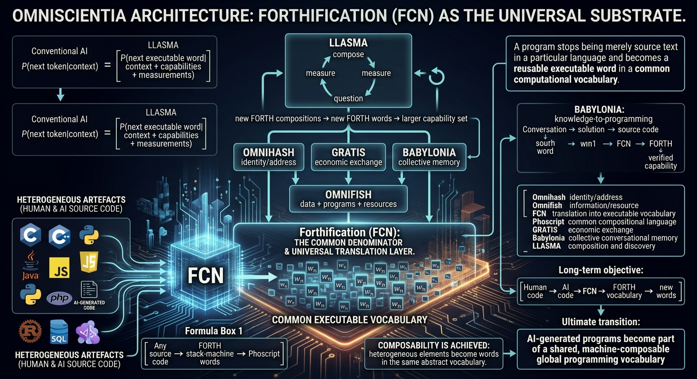

- [OMNISCIENTIA & Omnihash Referrals](https://omnixtar.github.io/dai/refer)

Omniscientia is an open source project that coordinates ordinary users and programmers in order to create a truly decentralised Artificial Intelligence ecosystem, which is in turn fully owned and operated by users and free software programmers.

- [Why Omnihash referrals 
 building blocks of Omniscientia](https://omnixtar.github.io/dai/why)

 

- [Referrals do not need additional cash](https://omnixtar.github.io/dai/referrals)

- [Trinity of Omniscientia: Babylonia, GRATIS & LLASMA-roc](https://omnixtar.github.io/dai/trinity)

Omnihash and Phoscript are the fundamental building blocks of Omniscientia, which in turn comprises three other modules, firstly LLASMA-roc real time audio sharing and mixing platform, secondly GRATIS Grand Unified AI Token Trading Platform and thirdly Babylonia AI conversation sharing platform.

- [UBI, Free Universal Education, Metanarchy & Nation States 2.0](https://omnixtar.github.io/dai/ns2)

- [Gandhi vs. Omniscientia](https://omnixtar.github.io/dai/gandhi)

Omnihash is a hash code system for representing ownerships of digital assets by associating the hash of a user's public key, representing the user's identity, with any other hash or hashes or string or strings, collectively representing digital assets of any kind, hence the prefix Omni, ranging from any text, source code, photo, videos and other documents.

The definition of Omnihash as presented above is evidently too complicated for men or women on the street to understand, but they need to, as this issue is as fundamental as peasants and workers before the French Revolution given the rights to own properties such as land, but they may not be literate enough to understand the issues. As such, we have devised a referral program where anyone promoting Omnihash to friends and associates may receive a reward, however small it is. 

- [FORTHification & Omniscientia
](https://omnixtar.github.io/dai/fcn)

Phoscript is a metaprogramming language derived from FORTH programming language, implemented as a metaprogramming shell within a host programming language, which mapped FORTH like reverse polish notation expressions to functions of the host programming language.

