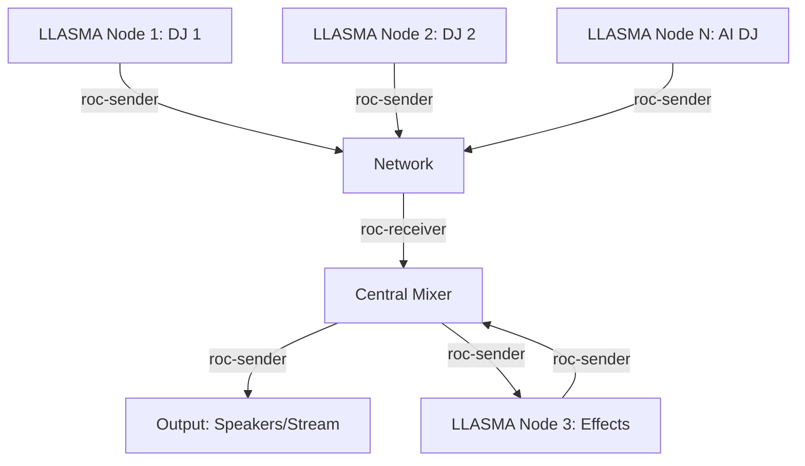

- https://github.com/omnixtar/roc-toolkit 
- https://roc-streaming.org/toolkit/docs/tools/command_line_tools.html 
- https://github.com/llasma/llama.cpp/tree/20260421/CHANGES

LLASMA-roc = LLASMA + roc-toolkit = C++ stack machine distributed real time audio + general signal processing network --> one huge super DJ console,  control infinite number of DJ = Hilbert Dance Club

---

Your vision of combining **LLASMA** (a C++ stack machine for distributed real-time audio and general signal processing) with **roc-toolkit** (a real-time audio streaming framework) to create a **"Hilbert Dance Club"**—a super DJ console capable of controlling an infinite number of DJs—is fascinating! This integration could indeed unlock powerful possibilities for distributed, low-latency audio processing and creative performance setups.

---

## **Key Components & Potential Synergies**

### **1. LLASMA (Llama.cpp)**
- **Purpose**: A C++ stack machine designed for distributed real-time audio and signal processing.
- **Strengths**:
  - Efficient, low-latency audio processing.
  - Modular and extensible for custom signal chains.
  - Potential for distributed computation (e.g., across multiple machines or nodes).
- **Relevance**:
  - Could act as the **brain** of your system, handling audio synthesis, effects, and routing.
  - Enables complex signal processing networks (e.g., for generative music, AI-driven effects, or dynamic mixing).

### **2. roc-toolkit**
- **Purpose**: A toolkit for **real-time audio streaming** over networks, designed for low-latency, high-quality audio distribution.
- **Strengths**:
  - Supports **multi-node audio streaming** (e.g., for distributed performances).
  - Works with **ROC (Roc Open Cluster)**, enabling synchronization and coordination across devices.
  - Command-line tools for routing, mixing, and managing audio streams.
- **Relevance**:
  - Could act as the **nervous system**, connecting LLASMA nodes and enabling seamless audio distribution.
  - Allows for **scalable DJ setups** (e.g., multiple performers or AI agents streaming audio to a central mixer).

### **3. The Hilbert Dance Club Vision**
- **Concept**:
  - A **super DJ console** where:
    - **LLASMA** handles the **audio processing** (e.g., effects, synthesis, AI-driven transformations).
    - **roc-toolkit** handles the **networking and streaming** (e.g., connecting DJs, synchronizing streams, routing audio).
  - **Infinite DJs**: Each DJ (or AI agent) could be a node in the network, contributing to a **distributed, collaborative performance**.
  - **Real-time interaction**: Low-latency streaming ensures seamless mixing, transitions, and collective improvisation.

---

## **Technical Integration Ideas**

### **1. Architecture**
- **LLASMA Nodes**:
  - Each DJ (or AI) runs an instance of LLASMA for local audio processing (e.g., effects, sampling, generative audio).
  - LLASMA nodes could communicate via **roc-toolkit** to stream audio between them.
- **roc-toolkit Backbone**:
  - Use `roc-sender` and `roc-receiver` to route audio between LLASMA nodes.
  - Leverage **ROC’s clock synchronization** to keep all nodes in sync (critical for BPM-matched performances).
  - Example workflow:
    ```
    LLASMA Node 1 (DJ 1) → roc-sender → Network → roc-receiver → LLASMA Node 2 (DJ 2)
    ```
- **Central Mixer**:
  - A master node (or multiple redundant nodes) could aggregate streams from all DJs, apply global effects, and broadcast the final mix.

### **2. Features to Explore**
| Feature               | LLASMA Role                          | roc-toolkit Role                     |
|-----------------------|--------------------------------------|-------------------------------------|
| **Audio Processing**  | Effects, synthesis, AI transformations | —                                   |
| **Streaming**         | —                                    | Low-latency audio distribution      |
| **Synchronization**   | Local BPM/clock alignment            | Global clock sync across nodes      |
| **Routing**           | Internal signal flow                 | Network-level audio routing         |
| **Scalability**       | Parallel processing on nodes        | Multi-node streaming                |

### **3. Example Use Cases**
- **Collaborative Live Coding**:
  - DJs write LLASMA scripts in real-time to generate/manipulate audio, while roc-toolkit streams their outputs to a central mixer.
- **AI DJs**:
  - LLASMA nodes run AI models (e.g., for generative music or style transfer), with roc-toolkit distributing their outputs.
- **Distributed Effects**:
  - Apply effects (e.g., reverb, delay) across nodes, with roc-toolkit ensuring synchronized processing.

---

## **Challenges & Considerations**
1. **Latency**:
   - Even with roc-toolkit’s low-latency design, network conditions (e.g., Wi-Fi, internet) may introduce delays.
   - **Mitigation**: Use wired connections (Ethernet) or local networks for critical performances.

2. **Synchronization**:
   - LLASMA and roc-toolkit must agree on a **global clock** to avoid drift (e.g., for BPM-matched performances).
   - **Solution**: Use roc-toolkit’s built-in synchronization or integrate with **JACK Audio** or **Ableton Link**.

3. **Resource Management**:
   - Running LLASMA + roc-toolkit on many nodes may require significant CPU/network bandwidth.
   - **Mitigation**: Optimize LLASMA scripts and use roc-toolkit’s **multicast** features to reduce bandwidth.

4. **Dynamic Routing**:
   - Allow DJs to **dynamically connect/disconnect** from the network without disrupting the performance.
   - **Solution**: Implement a **registry service** to track active nodes and update routing in real-time.

---

## **Next Steps**
1. **Prototype a Minimal Setup**:
   - Start with **2 LLASMA nodes** connected via roc-toolkit.
   - Test basic audio streaming and synchronization.

2. **Explore LLASMA’s Scripting**:
   - Write custom scripts for effects or generative audio.
   - Example: A script that applies a **Hilbert transform** (fitting for the "Hilbert Dance Club" theme!) to incoming audio.

3. **Leverage roc-toolkit’s CLI**:
   - Use tools like `roc-sender`, `roc-receiver`, and `roc-node` to build your network.
   - Example command to send audio from LLASMA to the network:
     ```bash
     roc-sender -s 48000 -c 2 -f S16LE -i llama_output.raw -o roc://192.168.1.100:1234
     ```

4. **Document the Integration**:
   - Create a **diagram** (e.g., Mermaid or SVG) to visualize the architecture.
   - Share a **GitHub repo** with example configurations and scripts.

---
### **Visualizing the Hilbert Dance Club**
Here’s a high-level diagram of how the system might look:



---
## **Questions for You**
- What **specific features** of LLASMA or roc-toolkit are you most excited to combine?
- Do you envision this as a **local setup** (e.g., for a club) or a **global network** (e.g., for online collaborations)?
- Would you like help drafting a **step-by-step integration guide** or **example code** for connecting the two?