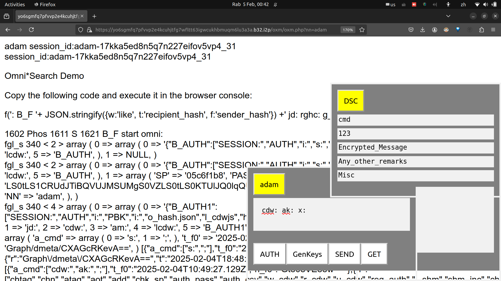

<table><tr>
<td>
<table><tr><td></td><td><h2>Omni*Web 全臻网</h2></td></tr></table> 
</td>
<td>
</td></tr></table>

<!-- 
- ### Omnisophia: Bitcoin + Decentralised AI
- ### *YOUR brain is the weapon .... Omnisophia Metanarchy Revolution.* 
-->
<!-- 

-->

## 构建 《全臻网 无量智 Omni*Web Delta AI》 生态
### -- Omniscientia 全臻道、 GRATIS 词元代币交易平台、 LLASMA-roc 网律乐

- A. [[《基于增量智能（Delta AI）的增量通用人工智能（AGI）自举框架》(YouTube视频)]](https://www.youtube.com/watch?v=WFcDZ5WjfeI)
  - [[中文字幕讲稿]](https://omnixtar.github.io/dai/cn_youtube) [[视频重点摘要]](https://omnixtar.github.io/dai/zongjie)
  - 中文译名备注:
    通用的中文翻译名词如下 --
      Delta 增量; Intelligence 智能; Artificial 人工; General 通用。
    - 作为品牌名词，我们采用“无限增量”=“无量”+“智能”=“无量智”。
- B. [[Omniscientia 共享AI对话平台 与 GRATIS AI代币交易平台
]](https://omnixtar.github.io/dai/osgt)
  - [[LLASMA-ROC 网律乐 + Omnihash 全杂数 + Phoscript 符式词元：去中心化的财富重新分配
]](https://omnixtar.github.io/dai/s-curve)
- C. 历史背景、哲学、法律定义 [[从法国大革命到 Metanarchy 元宇宙自治]](https://omnixtar.github.io/dai/cn_revolution)
- [[元宇宙自治 Metanarchy 无形政府]](https://omnixtar.github.io/dai/cn_metanarchy)
- D. [[SVFIG Silicon Valley FORTH Interest Group 硅谷弗式兴趣小组 完整视频+pdf]](https://omnixtar.github.io/svfig/)
- E. 技术背景及定义 [[Phoscript 符式词元 操作原理
]](https://omnixtar.github.io/phoscript/cn) 
  - [[Omnihash 全杂数 原理]](https://omnixtar.github.io/cn/omnihash-cn)

---

### 全臻网 Omni*Web 名称由来

全臻网 Omni\*Web 以 Omnihash 全杂数 及 Phoscript 符式词元 为基础算法, 构建 去中心化 AI 对话分享平台 Omniscientia -- 拉丁文原意 “全能知识”。 Scientia 知识 也是 Science 科学 的词根，切音为 “臻道”，故名“全臻道”。 以“全臻道”延伸到 Omni\*Web 成为“全臻网”。  

[**[Omnihash]**](https://omnixtar.github.io/cn/omnihash-cn) 是一种**代表各类数字资产（包括一般信息、程序代码及算力）**及其所属用户身份及所有权的**哈希数**（又称“杂凑数”），故名**“全杂数”**。
  - Omnihash 全杂数 是 Omni*Web 全臻网 最重要的突破之一， 它 **以去中心化的加密算法** 定义了 数字化时代的 **数字资产所有权** 及 **其所属法人的身份**。 其意义堪比 [[**法国大革命**]](https://omnixtar.github.io/dai/cn_revolution)， 在工业革命初期， 为所有人， 尤其当年下层的农民和工人， 确定了前所未有的 **财产所有权**（产权）。
  - 去中心化加密算法， 即主要为： 
    - （I） 以公钥字串的哈希码表示资产所属用户身份。 
    - （II） 以一个公钥哈希码连接 (concatenate) 至少一个代表数字资产的字串， 表示该数字资产的所有权。
    - （III） 以上任何一类， 第一类的单一公钥哈希码， 或第二类复合字串的哈希码， 再连接其他数字资产字串， 或其他复合哈希码， 成为复合字串， 再生成哈希码， 周而复始。
    - 以上的算法， 可以在个人用户的手机或电脑前端生成， 不牵涉其他大公司的后端电脑伺服器， 保障了个人数字资产的私密性， 成为去中心化加密算法的基础。  

[**[Phoscript 符式词元]**](https://omnixtar.github.io/phoscript/cn) 演变自 1968 年由 Charles H. Moore 查尔斯.摩尔 发明的 FORTH（符式）元编程程序语言（metaprogramming language），可以植入（embedded）各种宿主程序语言（host programming language），成为一种普世界面语言（universal interface language），即一种可以成翻译各种宿主程序语言的元编程语言，并简化学习及使用编程语言的难度，总结为 unify & simplify 统一及简化各种程序语言。
  - Omnihash 全杂数 使 Phoscript符式词元 及其他程序语言的**代码转换成为股权**， 变成可以被交易的商品。
  - Phoscript 符式词元 将编程简化成为一种**人人可以上手的技能**，再将这种技能变成 **Omnihash 全杂数股权**， 成为使人人能够入场的 **AI时代创业入场券**。

本文描述 Omni*Web 全臻网 基于 Omnihash 全杂数 及 Phoscript 符式词元 开发的三大应用，为普通用户及开源程序员在 AI 时代以**零门槛、零资金**， 集思广益， 联合开发顶级水平的，**全民共创**的**去中心化超级 AI 平台**：
- [[Omniscientia 全臻道 去中心化 AI 对话分享平台]](https://omnixtar.github.io/dai/osgt)
- [[GRATIS Grand Unified AI Token Trading Platform 去中心化人工智能词元代币交易平台]](https://omnixtar.github.io/dai/osgt)
  - Omniscientia 全臻道 和 GRATIS 分别代表 AI 的**软件(代码)**和**硬件(算力)**的**交易平台**， 以 Omnihash 全杂数 **使代码和算力转换成为股权， 变成可以被交易的商品**。
- [[LLASMA-roc 网律乐 “用网络规律（程序+协议）生成的音乐(音频)”]](https://omnixtar.github.io/dai/s-curve)
  - Omnihash 全杂数 **使音乐、音频及混音算法及代码转换成为股权， 变成可以被交易的商品**。

---
