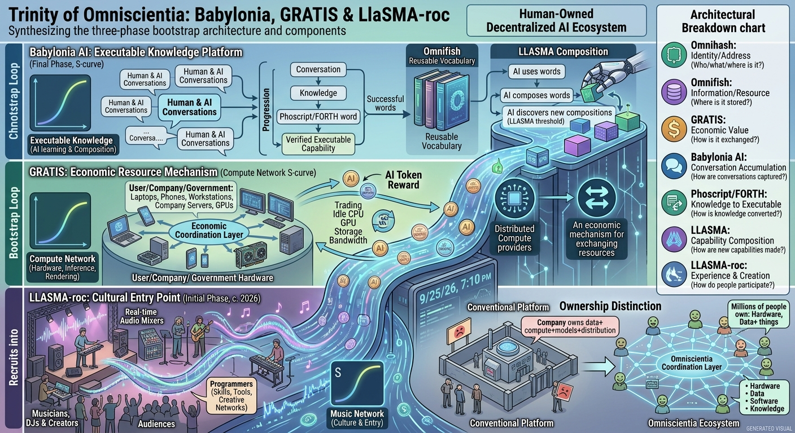

## Trinity of Omniscientia: Babylonia, GRATIS & LLASMA-roc



1. At the initial phase of Omniscintia, LLASMA-roc real time audio sharing and mixing platform plays a crucial role as influencers such as musicians and DJs will use it to create a new kind of music and recruit more users and programmers to Omniscientia.

1. GRATIS Grand Unified AI Token Trading Platform will enable users, programmers, companies and governments to trade idle CPU GPU resources, thus greatly reducing the costs of AI tokens and enabling all human beings to become providers of AI tokens instead of passive consumers.

1. Finally Babylonia AI conversation sharing platform will enable all human beings and AI agents to share convrsations, and continue to build up FORTH stack machines or Phoscript words, until the point where Omniscientia will be able to compose new stack machine words, and compete with frontier AI systems, but as an AI ecosystem that is owned and operated by all human users and programmers.

This gives Omniscientia a much clearer **three-stage bootstrap architecture**. The important point is that the three platforms are not separate products: each creates the conditions needed for the next.

### The Omniscientia bootstrap loop

**1. LLASMA-roc — attract people through culture**

Musicians, DJs and other creators use real-time audio sharing, mixing and DSP capabilities to create things that are difficult or impossible to produce through conventional centralized music platforms.

The important resource here is not merely users; it is **people with skills, computers, software and creative networks**.

$$
\text{Music creation}
\rightarrow
\text{Creators}
\rightarrow
\text{Audiences}
\rightarrow
\text{Programmers}
\rightarrow
\text{More capabilities}
$$

LLASMA-roc therefore becomes the **cultural entry point** into Omniscientia.

---

**2. GRATIS — turn distributed hardware into an economic resource**

Once people and companies are connected, they collectively possess enormous amounts of idle:

* CPU;
* GPU;
* storage;
* network bandwidth;
* rendering capacity;
* AI inference capacity.

GRATIS provides the economic mechanism for exchanging these resources.

Instead of:

$$
\text{AI user}\rightarrow\text{central AI company}\rightarrow\text{AI token}
$$

the network can move toward:

$$
\text{User/Company/Government}
\leftrightarrow
\text{GRATIS}
\leftrightarrow
\text{distributed compute providers}
$$

An AI token would therefore represent access to **actual computational services**, rather than merely being an abstract unit sold by a centralized provider.

The fundamental economic transformation is:

$$
\boxed{
\text{AI consumers}
\longrightarrow
\text{AI consumers + AI resource providers}
}
$$

A person's laptop does not need to compete with a hyperscale data centre. A million laptops, phones, workstations and company servers can collectively constitute a very substantial computational resource.

---

**3. Babylonia AI — turn conversations into executable knowledge**

This is perhaps the most important transition.

Babylonia AI would allow humans and AI agents to share conversations and progressively convert useful conversational discoveries into **FORTH/Phoscript words**.

The progression becomes:

$$
\text{Conversation}
\rightarrow
\text{Knowledge}
\rightarrow
\text{Phoscript}
\rightarrow
\text{FORTH word}
\rightarrow
\text{verified executable capability}
$$

Instead of allowing an important discovery to remain buried inside somebody's private conversation, the useful computational part can become a reusable building block.

For example:

```text
Human + AI
    ↓
Conversation
    ↓
Problem solved
    ↓
Phoscript word
    ↓
Verification
    ↓
Omnifish
    ↓
Reusable FORTH vocabulary
```

Over time, the vocabulary becomes enormous.

And then the role of AI changes.

Initially:

$$
AI \rightarrow \text{uses existing words}
$$

Later:

$$
AI \rightarrow \text{composes existing words}
$$

Eventually:

$$
AI \rightarrow \text{discovers new compositions}
\rightarrow
\text{new FORTH words}
$$

That is the LLASMA threshold you are describing.

### The complete architecture

$$
\boxed{
\begin{array}{ccc}
\textbf{LLASMA-roc}
&\rightarrow&
\textbf{GRATIS}\\
\text{People + creativity}
&&
\text{People + compute}\\
\downarrow&&\downarrow\\
% \multicolumn{3}{c}{
% \textbf{OMNISCITIENTIA NETWORK}
% }\\
\textbf{Babylonia AI}
&\leftarrow&
\textbf{Omnifish / Omnihash}\\
\downarrow&&\downarrow\\
\textbf{Babylonia AI}
&\leftarrow&
\textbf{Omnifish / Omnihash}\\
\text{conversations}
&&
\text{resources + identity}\\
\downarrow&&\\
\textbf{Phoscript / FORTH}\\
\downarrow\\
\textbf{LLASMA}\\
\downarrow\\
\textbf{New executable words}
\end{array}}
$$

Or, more simply:

> **LLASMA-roc brings people in.
> GRATIS makes their computers economically useful.
> Babylonia turns their conversations into executable knowledge.
> LLASMA eventually learns to compose that knowledge into new capabilities.**

### The ownership distinction

This also makes your political-economy thesis much sharper without requiring Omniscientia itself to own the world's computers.

A conventional AI platform tends toward:

$$
\text{Company owns}
\rightarrow
\text{data}
+
\text{compute}
+
\text{models}
+
\text{distribution}
$$

Your proposed ecosystem is:

$$
\text{Millions of people own}
\rightarrow
\text{hardware}
+
\text{data}
+
\text{software}
+
\text{knowledge}
$$

while Omniscientia supplies the **coordination layer**.

Thus:

$$
\boxed{
\text{Omniscientia does not need to own all the resources.}
}
$$

It needs to make independently owned resources **addressable, discoverable, composable, measurable and economically exchangeable**.

That is where Omnihash, Omnifish, GRATIS and LLASMA fit together:

| Layer               | Function                                               |
| ------------------- | ------------------------------------------------------ |
| **Omnihash**        | Who/what is this? Where is it addressed?               |
| **Omnifish**        | Where is the information/resource?                     |
| **GRATIS**          | What is its economic value and how is it exchanged?    |
| **Babylonia AI**    | How is human/AI conversation accumulated?              |
| **Phoscript/FORTH** | How is knowledge converted into executable capability? |
| **LLASMA**          | How can capabilities be composed into something new?   |
| **LLASMA-roc**      | How do people experience and create with the network?  |

The eventual feedback loop is therefore:

$$
\boxed{
\text{Creators}
\rightarrow
\text{Users}
\rightarrow
\text{Computers}
\rightarrow
\text{AI tokens}
\rightarrow
\text{Conversations}
\rightarrow
\text{FORTH words}
\rightarrow
\text{New capabilities}
\rightarrow
\text{Creators}
}
$$

That is considerably more powerful than presenting Omniscientia simply as “another decentralized AI platform.”

The deeper proposition is:

> **Omniscientia attempts to turn the human population itself into the ownership, resource, knowledge and development base of an AI ecosystem.**

And the ultimate milestone is not merely having millions of users. It is the point at which the accumulated network has enough **verified executable vocabulary** that LLASMA can autonomously compose new stack-machine words and thereby participate in frontier-level algorithmic development.

That gives you a very clean **S-curve narrative**:

$$
\boxed{
\text{Music}
\rightarrow
\text{Network}
\rightarrow
\text{Compute}
\rightarrow
\text{Conversations}
\rightarrow
\text{Executable Knowledge}
\rightarrow
\text{Composition}
\rightarrow
\text{New Intelligence}
}
$$

The crucial distinction is that the final intelligence is intended to emerge from the **ecosystem's accumulated and composable capabilities**, rather than from ownership of a single giant model.
