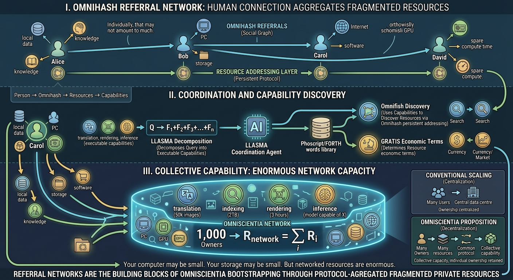

## Why Omnihash referrals $$\rightarrow$$ building blocks of Omniscientia

- Why would Omnihash referrals become the building blocks of a decendetralised AI ecosystem? 

Because when human beings form a network, they utilise resources that each of them owns. The resources owned by one man are limited. The resources owned by a thousand human beings are enormous.

This gives the Omnihash-referral idea a deeper foundation: 
- **the referral network is not merely a social graph; it can become a mechanism for aggregating otherwise fragmented resources.**

A useful distinction is:

$$
\boxed{\text{One person has limited resources; a network has access to many people's resources.}}
$$

### From individual ownership to network capacity

Suppose one person owns:

* a PC;
* some storage;
* an Internet connection;
* software;
* local data;
* knowledge;
* perhaps a few hours of spare computing time.

Individually, that may not amount to much.

Now suppose 1,000 people voluntarily connect their resources:

$$
R_{\text{network}}
=
\sum_{i=1}^{1000}R_i
$$

The aggregate can become substantial even though **ownership has not been centralised**.

That is fundamentally different from:

$$
1,000\text{ people}
\rightarrow
\text{one company}
\rightarrow
\text{company owns everything}
$$

Omniscientia is trying to explore:

$$
\boxed{
1,000\text{ people}
\rightarrow
1,000\text{ owners}
\rightarrow
1\text{ interoperable network}
}
$$

### Why the referral mechanism matters

The problem is coordination.

Alice doesn't know what Bob's computer can provide.

Bob doesn't know that Carol has a useful dataset.

Carol doesn't know that David has a powerful GPU.

David doesn't know that Alice needs exactly the computation he can provide.

Omnihash can potentially provide the persistent addressing layer:

$$
\text{Person}
\rightarrow
\text{Omnihash}
\rightarrow
\text{Resources}
\rightarrow
\text{Capabilities}
$$

Then the network can discover resources without requiring a single organisation to own them.

### And this is where AI changes the equation

Humans traditionally struggle to coordinate millions of heterogeneous resources.

AI agents can potentially perform much of the coordination:

> “I need 50,000 images translated, 2 TB indexed, three hours of rendering and an inference model capable of doing X.”

LLASMA could eventually decompose that requirement into executable capabilities:

$$
Q
\rightarrow
F_1+F_2+F_3+\cdots+F_n
$$

Omnifish discovers where those capabilities exist.

Omnihash identifies the relevant resources and their owners.

GRATIS determines the economic terms.

The owners remain owners.

### The result is a different kind of scale

The conventional cloud model scales by **centralising resources**:

$$
\text{Many users}
\rightarrow
\text{Central data centre}
$$

The Omniscientia proposition is:

$$
\text{Many owners}
\rightarrow
\text{Many resources}
\rightarrow
\text{Common protocol}
\rightarrow
\text{Collective capability}
$$

So the network can become enormous without any individual participant needing enormous resources.

That gives a very strong principle for the brochure:

> **Your computer may be small. Your storage may be small. Your spare computing time may be small. Your contribution may be small. But a thousand small contributions can form a large computational resource — without anyone having to surrender ownership of their contribution.**

And perhaps the shortest version:

$$
\boxed{
\textbf{Individual resources are limited.}
\quad
\textbf{Networked resources are enormous.}
}
$$

That is arguably the fundamental economic reason **Omnihash referrals can bootstrap Omniscientia**: the referral creates the human connection first; the protocol can then turn those human connections into **permissioned access to a distributed pool of privately owned resources**.
