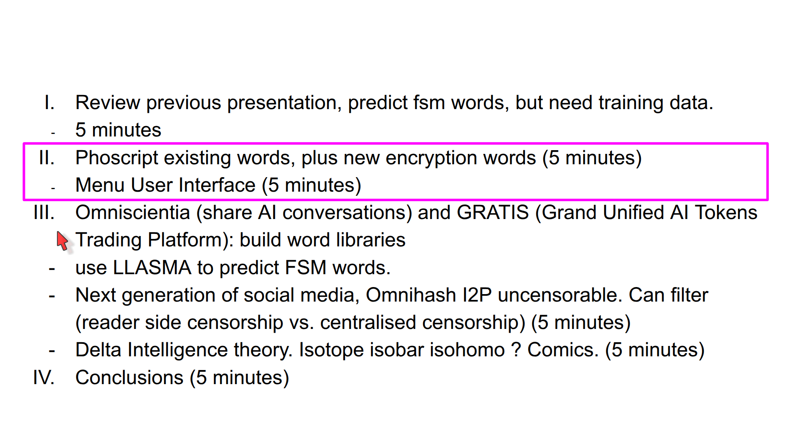
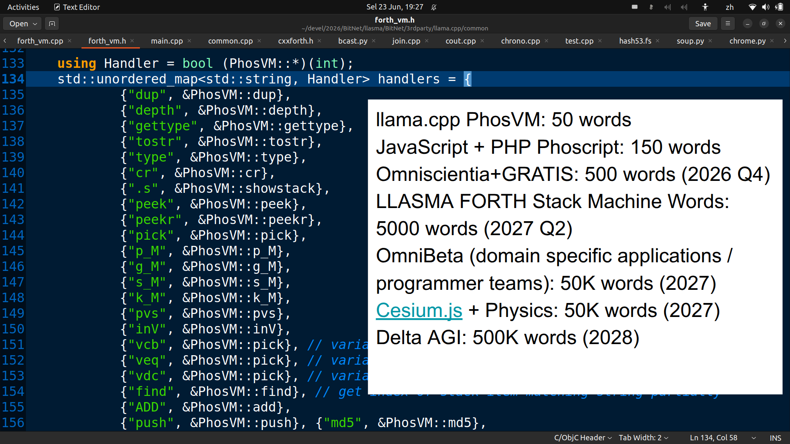

## 增量智能 Delta Artificial Intelligence

以下是对该视频演讲《Bootstrapping Delta AGI using Delta AI》的深度分析与总结：

### 一、 核心主旨
本次演讲提出了一种通过 **“增量智能（Delta Intelligence）”** 和 **Forth 编程语言**来引导和构建通用人工智能（Delta AGI）的极简主义方案。演讲者 Liang Ng 主张利用免费/开源的 AI 基础设施（如无需 GPU 的 `llama.cpp`），结合 Forth 栈式虚拟机的元编程能力，构建一个去中心化、由全球程序员协作驱动的 AI 生态系统，旨在打破科技巨头对前沿 AI 的垄断。

---

### 二、 核心理论与概念分析
1. **增量智能 (Delta Intelligence)**
   - **灵感来源**：信号处理中的“增量调制”（只编码信号差异以节省带宽）以及自由软件的渐进式开发模式。
   - **核心思想**：AGI 的诞生不需要依赖少数精英在封闭实验室里的“大爆炸”，而是通过全球开发者对现有代码（如 Forth 词库）进行持续的、微小的增量改进来“涌现”。自由软件是这种智能在人类历史上的最大体现。
2. **递归希尔伯特旅馆 (Recursive Hilbert Hotel)**
   - **跨界融合**：将抽象数学（无限集合）与计算机科学（Forth 栈机器）完美结合。
   - **隐喻与机制**：
     - **房间号** = 公钥哈希（代表数字资产、身份和所有权）。
     - **旅馆的无限性** = Forth 单词的基数（由冒号定义中使用的原始词数量决定）。这为 AI 的无限扩展能力提供了数学和逻辑上的理论支撑。

---

### 三、 技术实现与系统架构
1. **Forth 与 LLM 的底层融合 (Phoscript in llama.cpp)**
   - **技术突破**：在 `llama.cpp` 的 C++ 核心（`main.cpp` 的输入循环）中直接嵌入 Forth 解释器。
   - **意义**：使大语言模型能够直接理解和执行 Forth 栈机器指令（即“逆向图灵测试”：AI 编写 Forth 程序），实现了代码与数据的同构（Homoiconic），让 AI 具备真正的元编程能力。
2. **极简词库设计**
   - C++ 底层约 50 个核心词，Web 端（JS/PHP）约 150 个词。这证明了 Forth 作为“通用语（lingua franca）”的极简本质——用最少的词汇即可实现复杂的 Web/移动交互（如加密登录）。
3. **安全与去中心化底层**
   - **Omnihash**：基于公钥哈希的认证系统（类似 SSH），用于确立数字资产（包括源代码）的绝对所有权。
   - **去中心化 JSON (Decentralized JSON)**：通过将哈希码拼接到 JSON 字符串中，实现无需信任第三方的所有权证明。
   - **I2P (隐形互联网项目)**：结合 I2P 绕过传统 DNS，实现真正的去中心化、抗审查网络。

---

### 四、 项目愿景与生态路线图
演讲者规划了一个名为“Omni”的去中心化 AI 协作生态，旨在解决自由软件开发者“贡献大、收益小”的痛点，将“审查”转变为“用户端过滤”：
- **Omniscientia & GRATIS**：[[参考链接]](https://omnixtar.github.io/dai/cn_youtube#omniscientia-%E5%85%B1%E4%BA%ABai%E5%AF%B9%E8%AF%9D-%E4%B8%8E-gratis-ai%E4%BB%A3%E5%B8%81%E4%BA%A4%E6%98%93%E5%B9%B3%E5%8F%B0)
  - Omniscientia 去中心化的 AI 共享对话论坛，通过代币化激励开发者，以 Omnihash 建立合作协议，分享代码，相互协作，共同开发。 
  - GRATIS AI算力/代币交易平台。利用全球闲置的 GPU/CPU 算力，通过 Omnihash 代币化进行算力交易。
- **发展路线图**：
  - **2026 Q2**：llama.cpp PhosVM: 50 words
    - JavaScript + PHP Phoscript: 150 words
  - **2026 Q4**：Omniscientia+GRATIS: 500 words (2026 Q4)
    - [[参考链接]](https://omnixtar.github.io/dai/cn_youtube#omniscientia-%E5%85%B1%E4%BA%ABai%E5%AF%B9%E8%AF%9D-%E4%B8%8E-gratis-ai%E4%BB%A3%E5%B8%81%E4%BA%A4%E6%98%93%E5%B9%B3%E5%8F%B0)
  - **2027 Q2**：积累 5,000 个 Forth 弗式堆栈机词元。 
    - LLASMA FORTH Stack Machine Words: 5000 words (2027 Q2)
  - **2027 Q4**：推出 OmniBeta，支持多团队开发高质量的特定领域应用。
    - OmniBeta (domain specific applications / programmer teams): 50K words (2027)
    - Cesium.js + Physics: 50K words (2027)
  - **2028 年**：达到 500,000 个词（包含 Cesium.js 物理/地球模拟等“接地 AI”），形成足以抗衡科技巨头的开源 AGI 力量（类比当年 Linux 击败专有 Unix 系统）。
    - Delta AGI: 500K words (2028)

---

### 五、 Q&A 环节的核心洞察
- **Forth 作为“通用语”**：Kevin 指出 Forth 将语言本质精简到最小，使其成为扩展其他语言（如 Cozy）的“主干”。这印证了 Forth 在 AI 元编程和中间件开发中的独特优势。
- **协作与商业闭环**：面对“如何建立语言社区并实现商业模式”的质疑，Liang Ng 的解答是：通过**密码学确权（Omni Hash + 去中心化 JSON）**，让每一个贡献的源代码或 Forth 词都成为可追溯、可交易的数字资产，从而通过代币经济（GRATIS）实现商业闭环。

---

### 六、 综合评价与深层启示
1. **范式转换**：该方案将 AGI 的发展路径从“训练巨型黑盒模型”转向“构建可解释、可组合的栈机器词库”。这为 AGI 提供了一条白盒化、开源化、社区驱动的新路径。
2. **H3A 原则的完美实践**：该架构天然契合您之前关注的 H3A 原则：
   - **Hilbertian（希尔伯特式/无限）**：递归希尔伯特旅馆提供了无限扩展的理论框架。
   - **Hashed（哈希化/确权）**：Omni Hash 和去中心化 JSON 解决了数字主权和所有权问题。
   - **Homoiconic（同构/元编程）**：Forth 代码即数据，AI 可直接操作自身逻辑。
3. **挑战与展望**：理论极其宏大且自洽，但现实挑战在于如何吸引足够的开发者参与“增量”建设，以及管理 50 万个 Forth 词库的语义一致性。然而，其利用密码学和去中心化网络解决 AI 时代“算力垄断”和“开源剥削”的思路，具有极高的前瞻性和战略价值。