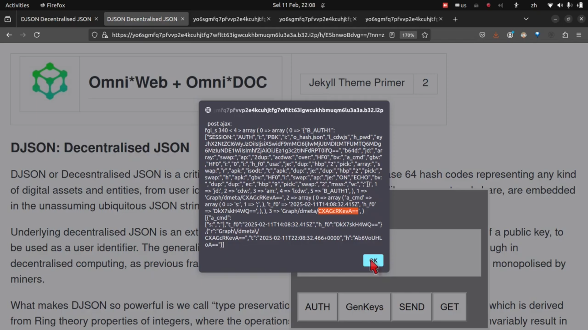

> 原文出处：https://omnixtar.github.io/contract/

### Omni*Contract：数字资产（源代码）的所有权与使用权
- **兼论源代码的披露与版税分离 ("察用分家")**
- 2024年7月21日

本文演示一个基于哈希数(杂凑数、Omnihash 全杂数), 让两方用户 (或三方以上) 签订 **去中心化数字合约** 的算法。 

A. 以下是一个 "察用分家" (数字资产的所有权与使用权分离) 的合约文字样板:

1. 你，作为公司或政府机构的人类代理人，可以阅读源代码而无需向作者支付费用；但如果你代表你的公司或机构将本程序用于商业目的，我们保留向你或你的公司/机构收取版税的权利。

2. 你的源代码副本应附带至少一份 Omnihash 合约，其中包含Omni*Agent 的 Omnihash 和您自己的 Omnihash，以授权您使用或修改所述源代码，否则您将因部署与第（1）条相关的源代码所造成的损害，承担您所在司法管辖区法律允许的最高处罚。

B. (A)部分的合约文字, 将被转化为哈希数(杂凑数、Omnihash 全杂数), 细节如以下 Omnihash 全杂数及 DJSON (去中心化JSON) 所述。

---

- Omnihash 中文定义

### Omnihash 与 DJSON Decentralised JSON (去中心化JSON)

1\. **DJSON Decentralise JSON（去中心化JSON）** 是一个 JSON 物件 (Object) 或其编码字符串，其中至少有一个字段是 Omnihash，即用户公钥的哈希值，代表该 JSON 对象的所有者。

- ```["2025-10-24T14:25:28.207+0000","like","CXAGcRKevA==","CXAGcRKevA==","HymWBzfj9A==",{"repo":"https://github.com/omnixtar/omnixtar.github.io/","contract":"https://omnixtar.github.io/contract/","ghh":"https://github.com/omnixtar/omnixtar.github.io/commit/19bb258190d57d6246840bf8ccc8957ae880e341","datetime":"2025-10-24T04:41:21.000Z"}]```


2\. DJSON 本身也可以被转化为哈希数，从而成为另一个 Omnihash。以上的 DJSON 将转化为以下的 Omnihash:

- **Omnihash: `DgV6_qnujw==`**

---

### Omnihash & DJSON 实操示范
- 按 F12 打开浏览器控制台。
- 运行以下代码：

- `omnistart()`\
`j0=["2025-10-24T14:25:28.207+0000","like","CXAGcRKevA==","CXAGcRKevA==","HymWBzfj9A==",{"repo":"https://github.com/omnixtar/omnixtar.github.io/","contract":"https://omnixtar.github.io/contract/","ghh":"https://github.com/omnixtar/omnixtar.github.io/commit/19bb258190d57d6246840bf8ccc8957ae880e341","datetime":"2025-10-24T04:41:21.000Z"}]`\
`s.push(JSON.stringify(j0))`\
`f('h53: b64: path:')`\
`s[s.length-1]`

- 浏览器控制台将输出 Omnihash:
  - **Omnihash: `DgV6_qnujw==`**

---

### DJSON 键值对 (key value pair) 详细说明

- ```["2025-10-24T14:25:28.207+0000","like","CXAGcRKevA==","CXAGcRKevA==","HymWBzfj9A==",{"repo":"https://github.com/omnixtar/omnixtar.github.io/","contract":"https://omnixtar.github.io/contract/","ghh":"https://github.com/omnixtar/omnixtar.github.io/commit/19bb258190d57d6246840bf8ccc8957ae880e341","datetime":"2025-10-24T04:41:21.000Z"}]```

在上述 DJSON 中，字段包括：
- 时间戳（timestamp）
- 动作(action): "like" **为这篇 GitHub Markdown 网页添加点赞功能**
- 当前用户 ID（current_user_ID）
- 上一条消息所有者（prev_msg_owner）
- 文档哈希（doc_hash）
- 消息（messages）

`doc_hash` 指文档 URL 的哈希值。

---

### 哈希数与合约文字的数学原理

1. 哈希数的存在意味着相关的输入文字已被输入哈希函数算式, 以得到该哈希数，此操作大概率是由第一方（或用户A）完成。

2. 第二方（除第一方之外的任何人，默认为您，用户B）可将输入原文输入相同的哈希函数算式，得到相同的哈希数，以验证 A方提供的哈希数的正确性，从而证明第一方确实执行了步骤（1）。

3. 步骤（2）意味着输入字符串与第一方的意图一致。

4. 步骤（3）是各方约定的默认推断。

---

### 视频演示



生成本网页 “点赞”的 DJSON 的步骤如[[视频演示]](https://youtu.be/_w-E4Z4Ju5s?si=W7U8jMF0kiX3RVCH&t=164)：

1. 将此网页副本保存为 Omni*Web 服务器上的本地文件。
1. 为此文档生成 `doc_hash`。
1. 以 `doc_hash` 为名创建该文档的子目录。
1. 复制必要的文件和软链接。
1. 在 [Omni*Web 服务器](https://yo6sgmfq7pfvvp2e4kcuhjtfg7wfltt63igwcukhbmuqm6lu3a3a.b32.i2p/h/E5bnwoBdvg==/?nn=z) 上使用 I2P（隐形互联网项目）和 `doc_hash` 打开本地副本。
1. 从浏览器控制台启动 Omni*Shell。
1. 使用用户的公钥刷新身份验证令牌。
1. 使用 Omni*Shell Phoscript 命令从浏览器控制台发送“点赞”DJSON。

如果上述步骤看起来令人生畏，那么你应当知道——这正是全球社交媒体上点赞按钮被点击时，每秒发生数百万次的事情：

- **只不过，你——用户和自由软件程序员——并不拥有和运营其中的任何部分，因此也无法从中赚到任何钱。** 

……这引出了 Omni*Web 的目标：

- **创建一个真正去中心化的 Web 生态系统，由自由的个人用户和自由软件程序员拥有和运营**，
- 能够为万亿美元级巨头企业（如 MMAGA——微软、Meta、亚马逊、谷歌和苹果的搞笑缩写）提供的所有现有服务提供自由替代方案。

- [Omni*Web: Crypto-Metaprogramming (CMP) as alternative to Model-View-Controller; towards Metanarchy](https://www.youtube.com/watch?v=P_M3PVn9J7I)

---

## [Omnihash 全杂数：给数字资产上“地契”](../cn/qzt)

“全杂数”是 **Omnihash** 的中文译名。

它的基础概念，类似比特币的“公钥哈希数”——但我们的团队独立将其发展为更通用的形态：

- **将“公钥哈希数”作为“用户身份识别码”，以及“用户拥有数字资产”的数字产权识别码。**

这是一个基于整数理论和字串组合的奇妙数学特性。由于各种人为因素（学界沉迷于更复杂的密码学，商界忙于建围墙花园），它成了学界和商界的“漏网之鱼”。

但“漏网之鱼”恰恰是留给我们的礼物。

因为字串可用于表示**任何数字资产**——文字、图片、视频、程序源代码、AI模型权重、地理数据、金融合约……一切皆可字串化。而字串的哈希码（又称“杂凑数”），则可以表示该数字资产的**用户所有权**。

用户及数字资产可以为复数，所以 **全杂数 Omnihash 可以表示任何人或组织的任何数字资产所有权**——故名“全杂数”。

简单说：**全杂数就是数字世界的“地契”。** 不需要任何中心化机构给你发证，你自己就能证明“这东西是我的”。

