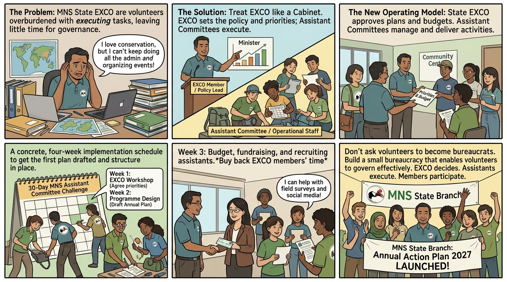

## Malaysian Nature Society
### Assistant Committee in MNS State branches

Executive Committee EXCO in MNS State branches have become a misnomer as their members have little time and money to actually execute tasks.

They are more like Cabinet -- comprising Ministers who need Ministries and bureaucrats to actually get work done.

Assistant Committee is the equivalent of Ministries to Ministers -- branch EXCO shall draft annual plan, with the help from MNS HQ or external experts, find budget to hire Assistants -- plenty of students or part time professionals willing to help.

First step is to help MNS State branches set up Assistant Committee and get annual plan drafted within one month.

---

Yes. The key organisational insight is that **MNS State EXCO should be treated as a governing body rather than an operating workforce**. The problem is therefore not necessarily that EXCO members are inactive; the structure asks volunteers with limited time and resources to perform functions that require dedicated staff.

A practical reform could be called the **MNS Assistant Committee Programme**.

### 1. Change the operating model

**Current implicit model**

> EXCO → plans → personally executes → reports

**Proposed model**

> **State EXCO → sets priorities, approves plans and budgets → Assistant Committees → execute programmes → volunteers/students/partners → deliver activities**

This resembles the relationship between a cabinet and ministries:

* **EXCO member** = policy lead / minister
* **Assistant Committee** = ministry/department
* **Assistant Committee leader** = director/programme manager
* **Students & part-time professionals** = operational staff
* **MNS HQ** = central technical/support service

The important point is that **EXCO members remain accountable without having to personally perform every operational task**.

---

# MNS State Branch Assistant Committee Programme

### Objective

Within **one month**, every participating MNS State Branch should have:

1. a functioning Assistant Committee structure;
2. an agreed annual programme;
3. identified programme leaders;
4. preliminary budgets;
5. identified funding sources;
6. a list of students and part-time professionals who can assist;
7. a first 90-day implementation schedule.

### Four-week implementation

| Week       | Task              | Output                                             |
| ---------- | ----------------- | -------------------------------------------------- |
| **Week 1** | EXCO workshop     | Agree priorities and Assistant Committee structure |
| **Week 2** | Programme design  | Draft annual plan and activities                   |
| **Week 3** | Resources         | Budget, funding and assistant recruitment          |
| **Week 4** | Approval & launch | Final annual plan + first 90-day programme         |

### Suggested Assistant Committees

They need not all be permanent. A branch can create committees according to its annual plan.

For example:

**1. Nature & Conservation Assistant Committee**
Habitat restoration, biodiversity monitoring, citizen science.

**2. Education Assistant Committee**
Schools, universities, workshops and educational materials.

**3. Five Elements Assistant Committee**
Cycling, plant nursery, rowing, cooking and farm-fishing programmes.

**4. Events & Tourism Assistant Committee**
Nature walks, ecotourism, excursions and community events.

**5. Digital & Communications Assistant Committee**
Website, social media, photography, video, newsletters and digital membership.

**6. Fundraising & Partnerships Assistant Committee**
Corporate sponsors, grants, universities, local authorities and tourism partners.

**7. Membership & Volunteer Assistant Committee**
Recruitment, orientation, scheduling and volunteer management.

A small branch might begin with only **three committees** rather than creating a large bureaucracy.

---

## The critical innovation: buy back EXCO members' time

The budget should explicitly contain an item such as:

> **Assistant Committee operating budget**

Rather than expecting volunteers to finance activities personally, the EXCO's job is to identify what needs to be done and establish the resources necessary to do it.

For example:

**RM10,000 programme budget**

could potentially fund several part-time assistants rather than spending everything on a single event.

Students can undertake:

* field surveys;
* social-media work;
* event administration;
* photography;
* data entry;
* school outreach;
* tour assistance.

Part-time professionals can provide:

* accounting;
* grant writing;
* graphic design;
* environmental consulting;
* digital development;
* project management.

This creates a **talent pipeline into MNS**, rather than depending indefinitely on the same small group of volunteers.

---

# The one-month deliverable

I would make the first month extremely concrete.

Every State Branch produces a **one-page Annual Action Plan**:

### MNS ______ State Branch

**Annual Action Plan 2027**

**1. Three major objectives**

* Objective A
* Objective B
* Objective C

**2. Assistant Committees**

| Committee     | Leader | Assistants needed | Budget |
| ------------- | ------ | ----------------: | -----: |
| Conservation  | ___    |                 3 | RM ___ |
| Education     | ___    |                 4 | RM ___ |
| Five Elements | ___    |                 5 | RM ___ |
| Fundraising   | ___    |                 2 | RM ___ |

**3. Major activities**

| Activity     | Date | Participants | Revenue |  Cost |
| ------------ | ---- | -----------: | ------: | ----: |
| Cycling      | ___  |          ___ |   RM___ | RM___ |
| Nursery      | ___  |          ___ |   RM___ | RM___ |
| Rowing       | ___  |          ___ |   RM___ | RM___ |
| Cooking      | ___  |          ___ |   RM___ | RM___ |
| Farm fishing | ___  |          ___ |   RM___ | RM___ |

**4. Funding**

* membership
* activity fees
* sponsorship
* grants
* donations
* tourism revenue
* other partnerships

**5. First 90 days**

Three or four activities that will actually happen—not merely appear in the plan.

---

## A useful principle

The reform could be summarised as:

> **EXCO decides. Assistants execute. Members participate. Communities benefit.**

Or, more sharply:

> **Don't ask volunteers to become bureaucrats. Build a small bureaucracy that enables volunteers to govern effectively.**

And this makes the **Five Elements programme** particularly useful: it gives newly established Assistant Committees something tangible to execute immediately, rather than creating committees that spend their first year discussing what they might eventually do.

The **one-month target** could therefore be framed as an organisational campaign:

> ### **MNS 30-Day Assistant Committee Challenge**
>
> **30 days to turn an EXCO into an operating State Branch.**
>
> **Week 1:** Organise
> **Week 2:** Plan
> **Week 3:** Fund & recruit
> **Week 4:** Launch

That would make the reform measurable: **at the end of 30 days, there must be a plan, people, money and a first activity—not merely another committee.**
