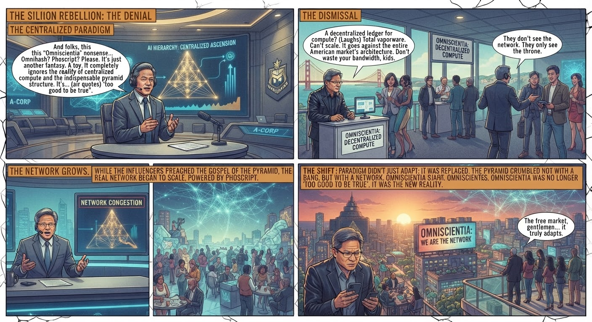
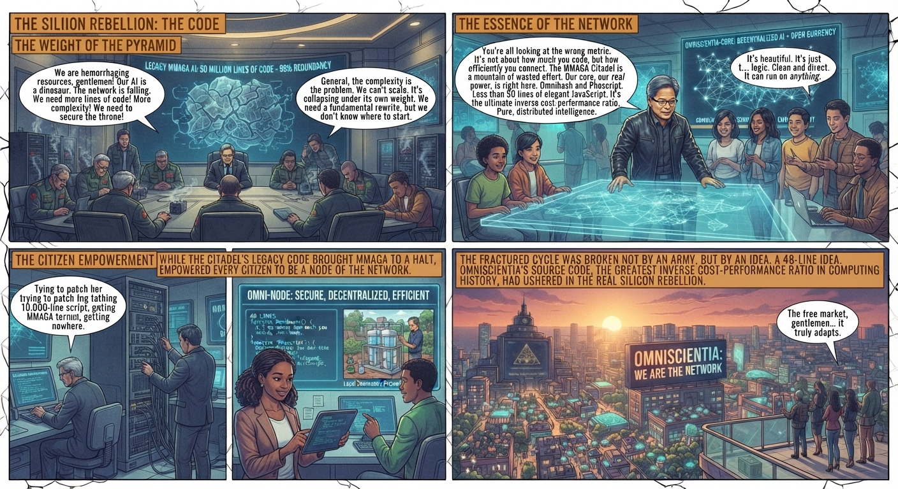
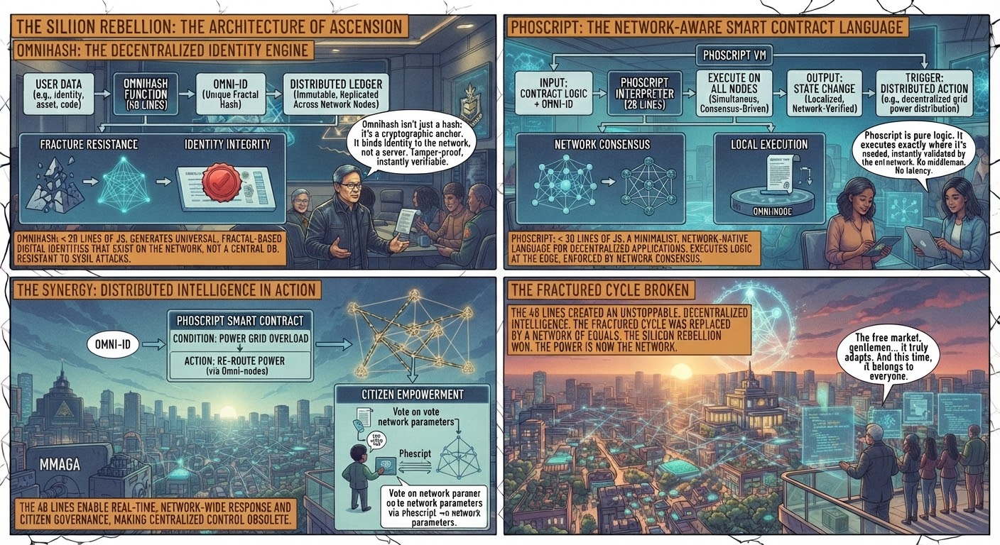
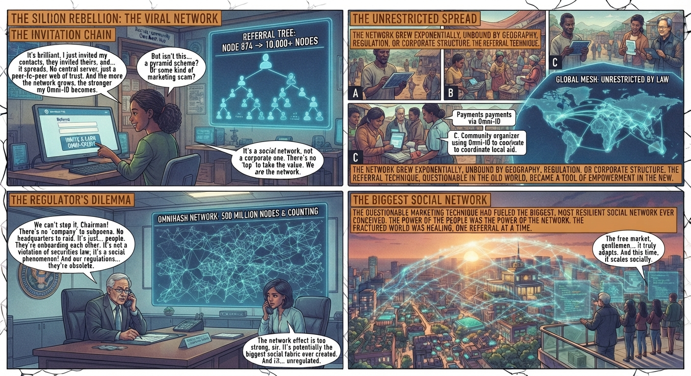

- Initially, many AI I influencers refused to acknowledge Omniscientia and its Omnihash and Phoscript, dismissing them to be too good to be true -- as they go against their American centralized pyramid paradigm.

- Omnihash and Phoscript source code is fewer than 50 lines of JavaScript or equivalent -- perhaps the biggest inverse cost performance ratio ever in computing history.

- Draw diagrams depicting functions of source code of Omnihash and Phoscript.

- It is also incredible that Omnihash can be spread using one of the oldest but sometimes questionable marketing technique -- online referral -- making it potentially the biggest social network ever, due to its decentralized nature, unrestricted by regulations covering operations by incorporated companies.

