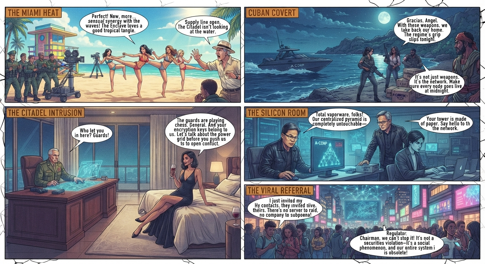
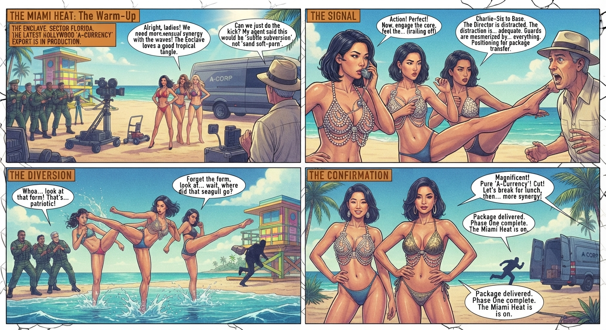
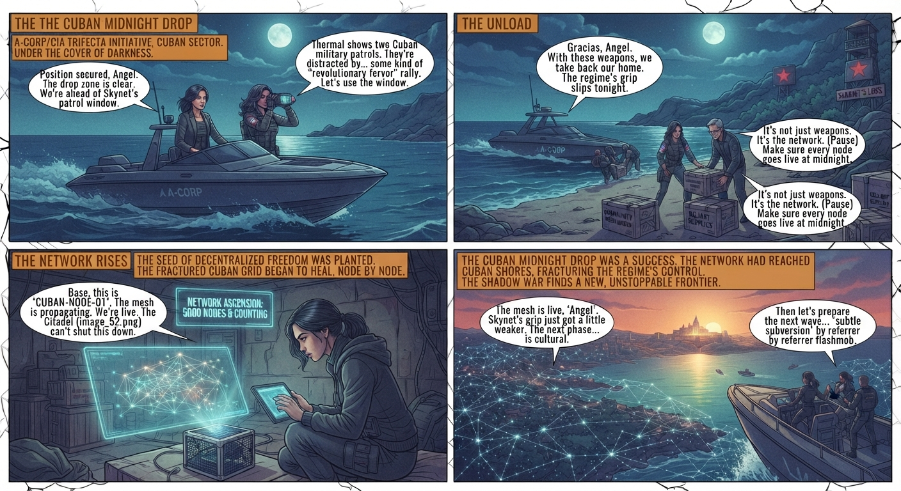
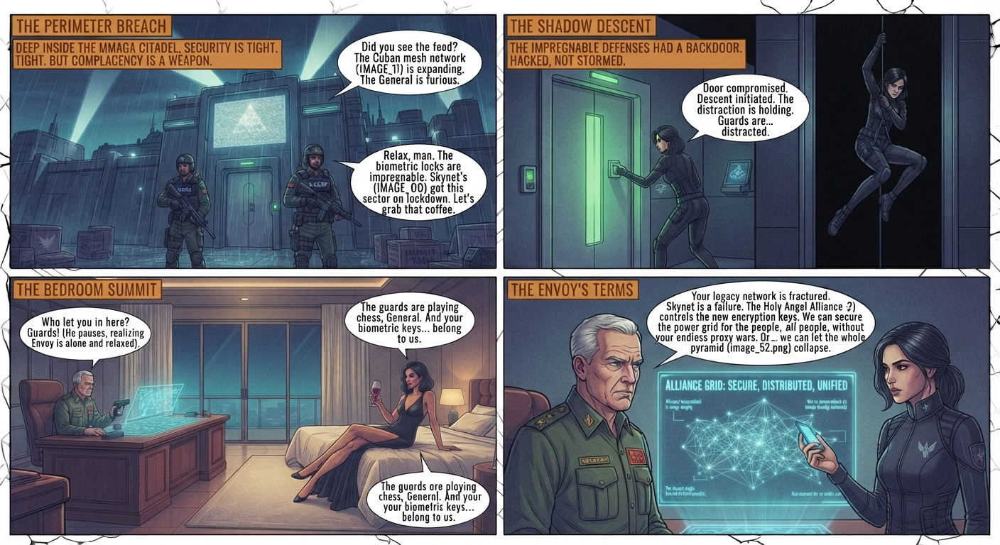

### 1. The Miami Beach Warm-Up

* **Setting:** A sun-drenched Miami beachside resort inside the MMAGA Enclave, framed by turquoise water and pastel lifeguard towers.

* **Action:** Glamorous actresses in bikinis execute synchronized, high-octane martial arts moves on the sand, blending soft-porn aesthetics with lethal combat. A group of bewildered MMAGA guards watch the film crew in awe, completely distracted as CIA-aligned assets slip past security.

* **Dialogue:**
> **Director:** "Perfect! Now, more sensual synergy with the waves! The Enclave loves a good tropical tangle."
> **Actress (whispering into a comm-link while executing a roundhouse kick):** "Supply line is open. The Citadel isn't looking at the water."
> 
> 

---

### 2. The Cuban Midnight Drop

* **Setting:** A moonlit coastline in Cuba, jagged cliffs overlooking dark, churning surf.

* **Action:** A stealth speedboat cuts through the water without a wake. Elite operatives—led by Nikita and her multi-ethnic team—unload heavy crates of decentralized communication gear right under the nose of patrolling communist guards.

* **Dialogue:**
> **Local Insurgent Leader:** "Gracias, Angel. With these weapons, we take back our home. The regime's grip slips tonight."
> **Nikita:** "It's not just weapons. It's the network. Make sure every node goes live at midnight."
> 
> 

---

### 3. The Citadel Bedroom Intrusion

* **Setting:** A high-security, plush penthouse suite deep inside the MMAGA Citadel, guarded by biometric locks.

* **Action:** General Thornton sits behind a heavy mahogany desk reviewing military strikes, unaware that the balcony sliding door has been silently unlocked. A member of the Holy Angel Alliance steps out of the shadows, lounging gracefully on the silk bed with a glass of vintage wine.

* **Dialogue:**
> **Thornton (reaching for his sidearm):** "Who let you in here? Guards!"
> **Alliance Envoy (sipping wine, smiling):** "The guards are playing chess, General. And your encryption keys belong to us. Let's talk about the power grid before you push us to open conflict."
> 
> 

---

### 4. The Silicon Server Room Infiltration

* **Setting:** A massive, humming server farm belonging to an arrogant AI influencer who is live-streaming his centralized pyramid scheme.

* **Action:** Dressed in sleek, minimalist tactical attire, a young protégé from Nikita's recruitment program bypasses layers of redundant MMAGA legacy code in seconds using a compact tablet. She drops a flash drive containing the 48-line *Omnihash* and *Phoscript* source code directly into the master terminal.

* **Dialogue:**
> **AI Influencer (on camera):** "Total vaporware, folks! Our centralized pyramid is completely untouchable—"
> **Protégé (pulling the drive):** "Your tower is made of paper. Say hello to the network."
> 
> 

---

### 5. The Viral Referral Flashmob

* **Setting:** A crowded, neon-lit university campus square surrounded by corporate billboards.

* **Action:** Thousands of students simultaneously tap their phones, activating a peer-to-peer referral tree that bypasses regional laws and corporate regulations. Holographic nodes light up the skyline like a digital constellation, instantly crashing the local financial regulators' monitoring screens.

* **Dialogue:**
> **Student Organizer:** "I just invited my contacts, they invited theirs. There's no server to raid, no company to subpoena."
> **Regulator (panicking over the phone):** "Chairman, we can't stop it! It's not a securities violation—it's a social phenomenon, and our entire system is obsolete!"
> 
>