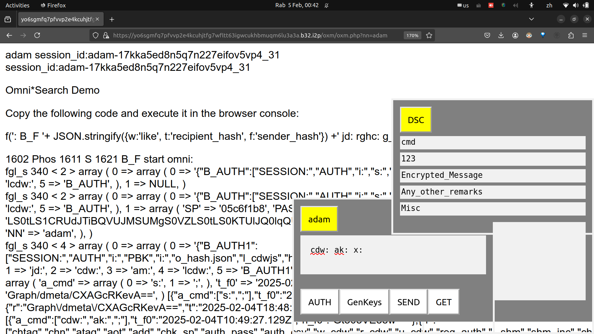

<table><tr>
<td>
<table><tr><td></td><td><h2>Omni*Web + Omni*DOC</h2></td></tr></table> 
</td>
<td>
<table><tr><td>Jekyll Theme Primer</td><td>2</td></tr></table>
</td></tr></table>

<!-- 
- ### Omnisophia: Bitcoin + Decentralised AI
- ### *YOUR brain is the weapon .... Omnisophia Metanarchy Revolution.* 
-->
<!-- 

-->

### List All Colon Definition Words
- cdw: ak: x:
- Enter the above in the nickname (adam) chat box. Click the nickname (adam) button to execute.
- cdw: Read all colon definition words in SESSION()
- ak: array_keys() extract array keys from associative array (JSON like)
- x: sends chat box expressions by AJAX to backend.

---

### Decentralised Monetised Collaboration 

Demon Collab 

Demon’s Con

Omni*DOC

It is interesting how word tricks in English and Latin play out.

The Latin root of “collaborate” is “con” + “laboro”, where “con” is a variation of “cum” meaning “with”.

As such, Decentralised Monetised Collaboration is shortened as “Demon's Con”.

We will tentatively use Demon's Con as the nickname for Decentralised Monetised Collaboration, as we have received feedback that the cryptocurrency industry now has such a bad reputation that we might as well use a Latin word trick to engage users. 

We know some self proclaimed Christians have long associated cryptography with the works of Demons, in folklores like 666. We are interested in engaging in conversation with Christians or any self proclaimed believers in monotheistic religions as we are aware that there are many countries which still practise laws that may prosecute anyone unilaterally as conducting blasphemy, some punishable by death, in 2025 Anno Domino.

However, bringing up Christian demons and 666 also appeals to a large number of fans who are critical of Christian traditions as well as those affected by bad publicity about cryptocurrency and decentralised technologies, bearing in mind that the Washington Wall Street elites prefer to brainwash the American population so that they continue to maintain their monopoly of power in politics and finance. 

Decentralised Monetised Collaboration 

Demon Collab 

Demon’s Con

As the name suggests, Decentralised Monetised Collaboration consists of 3 components: Decentralised infrastructure, Monetisation Legal Framework and Collaborative Transactions.

Collaborative transactions are the most common as they include everything from Google documents to TikTok posts. 

Decentralised infrastructure includes everything from I2P invisible internet project which enables everyone to set up server hosts connected to Internet without the Domain Name System, to Omnihash which is a novel hash algorithm for representing ownership of any kind of digital assets. 

Monetised Legal Framework means employing decentralised hash algorithms to establish digital legal contracts, including loans, payments and investments. 

What can we achieve by combining all 3 components of Decentralisation, Monetisation and Collaboration?

Adding Decentralisation to Collaboration will produce a UNIFIED interface to collaborative transactions. In plain English, it will enable you to combine posts and comments from ALL social media platforms into one integrated platform. 

For example, one of the biggest bottlenecks of chatting with artificial intelligence systems is that the conversation results cannot be automatically published, shared and put into collaboration with other users or AI systems.

With Omni*DOC, where D stands for Decentralisation, O for Oro or gold in Spanish, C for collaboration, a user’s conversation with any AI systems can be republished, shared, commented and so on just like any existing social media posts. 

Omni\*DOC will behave very differently from conventional social media platforms where the operator of the platform will appoint or employ moderators to filter inappropriate speeches. On Omni*DOC however, users themselves may make the decision to choose custom filters to filter out posts or comments that they themselves deem inappropriate. 

Omni*DOC works by first converting any URL into a hash code, which can be anything from 53 bits to 512 bits or longer. 

Secondly, the hash of URL of HURL will be shared amongst servers running Omni*Web modules.

Thirdly, any of Omni*Web servers may decide to create cache copies of a given URL for further processing. 

Up to this stage, Omni\*Web behaves like a Decentralised cache and search network, i.e. instead of a huge centralised search engine operated by one company such as Google or Microsoft, the power of Omni\*Web depends on the number server nodes participating. It basically works like Waybackmachine but its functionalities can be extended by any user or programmers, as long as they conform to Omni*Contract conditions and protocols. 

Social media functionalities exist from step 4 onwards. Although there exist differences amongst social media platforms, different user interface elements are essentially functions which can be represented as paths in graph theory. Further, different paths are represented as hashes, as the ring properties of integers ensure hashes can be concatenated as input to produce an output hash which is also another integer. We may call this property type preservation, namely, the types of inputs and output are preserved. The type preservation property of hashes makes it convenient to manage various types of functions on social media applications. 

First 3 stages, multiply servers. Applying hash in server address.

Stage 4, multiply functionalities. Applying hash in data address. 

In conventional MVC programming, function calls and data types are tightly coupled to types of data and how they are processed. In hash metaprogramming, everything is hash and hashes are compatible with each other due to type preservation property. 

Hash applicable in server and data addresses due to type preservation property. 

### Omni*DOC Example

This document itself is an example of Omni*DOC anyone may comment, share and follow up etc or add functions they wish.

Move this up as it is easiest to understand.

For example, chat results with AI, repost, comments, follow up. 

Demon Collab 

Demon’s Con

demonscon 

links to backend, backend use I2P addresses

- share
- comment
- like
- dislike
- etc.
- clone! novel feature non existant in other social media platforms.

<!--  -->





[Hello World!][1]
[1]:javascript:alert('Hello World')

[Omni*Web][1]
[1]:javascript:m_oxmobile()

[Hello World](javascript:%28function%28%29%7Balert%28%22Hello%20World%22%29%7D%29%28%29%3B)

[Omni*Web](javascript:%28function%28%29%7Bm_oxmobile%28%29%7D%29%28%29%3B)