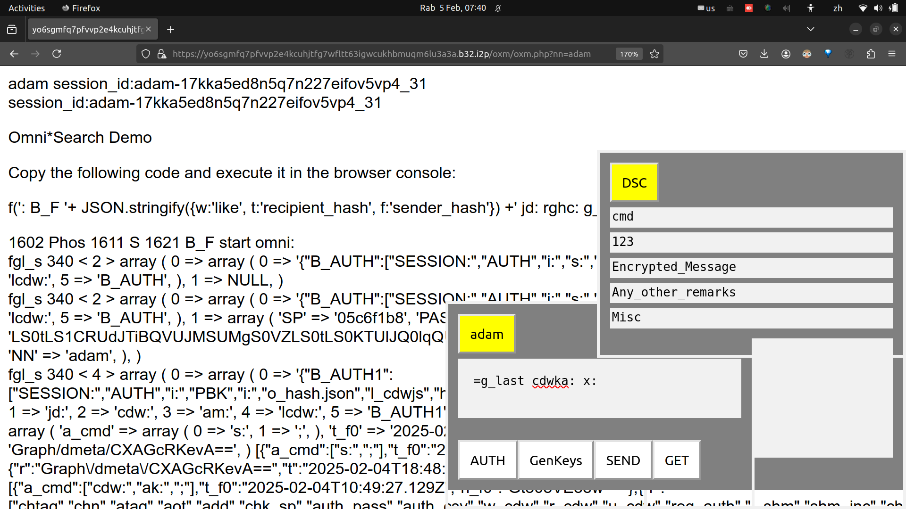
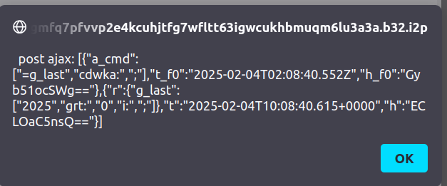

<table><tr>
<td>
<table><tr><td></td><td><h2>Omni*Web + Omni*Doc</h2></td></tr></table> 
</td>
<td>
<table><tr><td>Jekyll Theme Primer</td><td>2</td></tr></table>
</td></tr></table>

<!-- 
- ### Omnisophia: Bitcoin + Decentralised AI
- ### *YOUR brain is the weapon .... Omnisophia Metanarchy Revolution.* 
-->
<!-- 


-->

- cdw: ak:
- Read all colon definition words in SESSION()
- ak: array_keys() extract array keys from associative array (JSON like)




---

Here's an implementation of a basic FORTH shell in JavaScript. This code provides a stack-based interpreter with core FORTH functionality and a REPL interface:

```javascript
const readline = require('readline');

class ForthShell {
  constructor() {
	this.stack = [];
	this.dictionary = {
  	'+': this.binOp((a, b) => b + a),
  	'-': this.binOp((a, b) => b - a),
  	'*': this.binOp((a, b) => b * a),
  	'/': this.binOp((a, b) => Math.floor(b / a)),
  	'DUP': this.stackOp(1, s => { s.push(s[s.length-1]); }),
  	'DROP': this.stackOp(1, s => { s.pop(); }),
  	'SWAP': this.stackOp(2, s => { [s[s.length-1], s[s.length-2]] = [s[s.length-2], s[s.length-1]]; }),
  	'OVER': this.stackOp(2, s => { s.push(s[s.length-2]); }),
  	'.': this.stackOp(1, s => { process.stdout.write(s.pop() + ' '); }),
  	'EMIT': this.stackOp(1, s => { process.stdout.write(String.fromCharCode(s.pop())); }),
  	'CR': { type: 'builtin', code: () => process.stdout.write('\n') },
	};
  }

  binOp(operation) {
	return this.stackOp(2, s => {
  	const a = s.pop();
  	s.push(operation(a, s.pop()));
	});
  }

  stackOp(n, operation) {
	return {
  	type: 'builtin',
  	code: () => {
    	if (this.stack.length < n) throw new Error('Stack underflow');
    	operation(this.stack);
  	}
	};
  }

  processInput(input) {
	const tokens = input.toUpperCase().split(/\s+/).filter(t => t);
	let i = 0;
    
	try {
  	while (i < tokens.length) {
    	const token = tokens[i++];
    	if (token === ':') this.defineWord(tokens, i), i = tokens.length;
    	else this.processToken(token);
  	}
	} catch (e) {
  	console.error('Error:', e.message);
	}
  }

  processToken(token) {
	if (this.dictionary[token]) {
  	const entry = this.dictionary[token];
  	if (entry.type === 'builtin') entry.code();
  	else entry.code.forEach(t => this.processToken(t));
	} else if (!isNaN(token)) {
  	this.stack.push(parseFloat(token));
	} else {
  	throw new Error(`Undefined word: ${token}`);
	}
  }

  defineWord(tokens, i) {
	const name = tokens[i++];
	if (!name) throw new Error('Missing word name');
	if (!isNaN(name)) throw new Error('Invalid word name');
    
	const definition = [];
	while (i < tokens.length && tokens[i] !== ';') {
  	definition.push(tokens[i++]);
	}
    
	if (tokens[i] !== ';') throw new Error('Missing ;');
	this.dictionary[name.toUpperCase()] = {
  	type: 'user',
  	code: definition
	};
  }
}

// REPL Interface
const rl = readline.createInterface({
  input: process.stdin,
  output: process.stdout,
  prompt: 'FORTH> '
});

const forth = new ForthShell();

rl.prompt()
  .on('line', line => {
	forth.processInput(line);
	rl.prompt();
  })
  .on('close', () => {
	console.log('\nExiting FORTH shell');
	process.exit(0);
  });
```

Key features:

1. **Core Operations**:
   - Arithmetic: `+`, `-`, `*`, `/` (integer division)
   - Stack manipulation: `DUP`, `DROP`, `SWAP`, `OVER`
   - I/O: `.` (print), `EMIT` (ASCII character), `CR` (newline)

2. **User-defined Words**:
   - Create new commands using `: ... ;` syntax
   - Example: `: SQUARE DUP * ;`

3. **Error Handling**:
   - Stack underflow detection
   - Basic error messages

4. **REPL Interface**:
   - Interactive prompt
   - Case-insensitive input

To use:
1. Save as `forth.js`
2. Run with Node.js: `node forth.js`
3. Enter FORTH commands at the prompt

Example session:
```forth
FORTH> 5 3 + . 8
FORTH> : SQUARE DUP * ;
FORTH> 5 SQUARE . 25
FORTH> 72 101 108 108 111 EMIT EMIT EMIT EMIT EMIT CR Hello
```

Note: This is a basic implementation. Real FORTH systems include more features like:
- Floating-point operations
- Strings
- Control structures (IF/ELSE/THEN, loops)
- File I/O
- More sophisticated error handling

You can extend this base implementation by adding more operations to the `dictionary` object.
