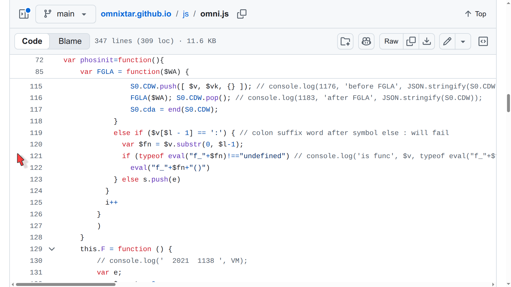
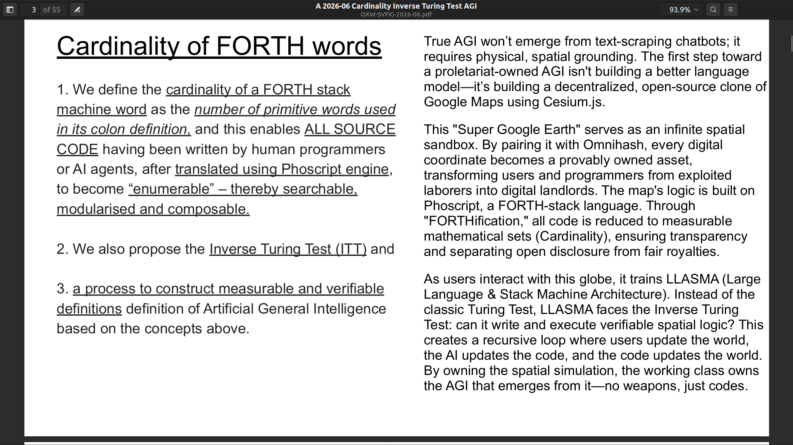

# Phoscript 符式词元 操作原理

Minimal implementation of Phoscript, typically as a shell function in a host (third generation) programming language, starts with around 20 lines of JavaScript or equivalent (including PHP, Python, Java, C, C++, etc.) It consists of a loop, splitting a space delimited string into tokens, pushing data tokens onto the stack, and calling eval() to execute function tokens, calling function in the host programming language. We believe such minimalist stack machine can be implemented in ANY known programming language.

https://docs.google.com/document/d/1ktZW5yDH-hqTo-XlTJfrg0gQH5gocFjYdFEFI2cJ-k0/edit?tab=t.0

**Phoscript 的最小实现**通常作为宿主（第三代）编程语言中的 shell 函数，始于约 20 行 JavaScript 或等效代码（包括 PHP、Python、Java、C、C++ 等）。它包含一个循环，将空格分隔的字符串分割为标记，将数据标记压入堆栈，并调用 `eval()` 来执行函数标记，即调用宿主编程语言中的函数。我们相信这种极简的栈式机器可以在**任何**已知编程语言中实现。

- [以 JavaScript 为宿主语言 host programming language 实现 Phoscript 内核案例](https://github.com/omnixtar/omnixtar.github.io/blob/main/js/omni.js)

Phoscript 内核的最基本操作如下:
- A. 包含一个循环，将空格分隔的字符串分割为词元 token，
- B. [函数词元] 如果词元对标宿主语言的函数 (function), 则调用 `eval()` 来执行该函数。(截屏图第 121 行)
  - [数据词元] 否则, 将该数据词元推送到堆栈顶端。(截屏图第 123 行)
- C. Phoscript 函数（函数词元） 从堆栈中获取输入，并将输出结果推送回堆栈顶端。

[为了让读者严谨的分析内容, 我们将英文表述列出, 作为对比。]

Phoscript engine works as follow:
- A. It consists of a loop, which splits a space delimited string into tokens.
- B. [function token] if the token maps to a function of the host programming language, it calls eval() to execute the function tokens. (line 121 in screenshot)
  - [data token] if the token is a data token, then it is pushed onto the the top of the stack. (line 123 in screenshot)
- C. Phoscript functions or WORDS, take input from the stack and push output results back onto the top of the stack.

以上的仿代码 (pseudocode) 虽然寥寥数行, 但却是自 Dijkstra 迪杰斯特拉 Shunting Yard Algorithm 调度场算法的核心, 用来实现各种程序语言的编译内核。 详情请参考以下视频。

- Phoscript 符式词元实现了 "逆向调度场算法" Inverse Shunting Yard Algorithm, 使 FORTH 老符式程序语言的词元语法, 能在各种程序语言内 (宿主程序语言) 实现运行, 间接实现 "统一各种程序语言"。

- Phoscript implements Inverse Shunting Yard Algorithm, making it possible to execute FORTH-like commands within various (ANY KNOWN) host programming languages, ultimately "unifiying all programming languages".

- [Bidirectional Shunting Yard Algorithm (BISYA) and Sandwich API Model: Unifying Programming Languages 双向调度场算法 (BISYA) 与 三明治模式: 统一各种程序语言](https://youtu.be/mYjKS0KiJVg)

将数据标记压入堆栈，并调用 `eval()` 来执行函数标记，即调用宿主编程语言中的函数。我们相信这种极简的栈式机器可以在**任何**已知编程语言中实现。

---
## 符式词元的基数 (Cardinality)

- Phoscript enables us to define the **cardinality of a FORTH stack machine word** as **the number of primitive words used in its colon definition**, and this, in turn, enables **ALL SOURCE CODE** having been written by human programmers or AI agents, after translated using Phoscript engine, to become **“enumerable”** – thereby **searchable**, **modularised** and **composable**.

- Phoscript 符式词元使我们能够将 FORTH 堆栈机器“词元”（word）的 **基数** 定义为在其冒号定义（colon definition）中所使用的原始词元（primitive words）的 **数量**。而这一点反过来又使得所有由人类程序员或 AI 代理编写的 **一切源代码**，在使用 Phoscript 引擎翻译之后，都变得 **“可枚举”（enumerable）**——从而具备 **可搜索**、**可模块化** 以及 **可组合** 的特性。

- [June 27 2026, BBF005 Cardinality of FORTH words,
Inverse Turing Test and defining AGI](https://omnixtar.github.io/svfig/OXW-SVFIG-2026-06.pdf) [[YouTube]](https://youtu.be/Qb2C_RftoiA)

- stack --> no variables --> composable

## 符式词元的可组合性 (Composability)

1. 我们重复参考符式词元的操作原理:

- Phoscript 内核的最基本操作如下:
  - A. 包含一个循环，将空格分隔的字符串分割为词元 token，
  - B. [函数词元] 如果词元对标宿主语言的函数 (function), 则调用 `eval()` 来执行该函数。
    - [数据词元] 否则, 将该数据词元推送到堆栈顶端。
  - C. Phoscript 函数（函数词元） 从堆栈中获取输入，并将输出结果推送回堆栈顶端。

2\. 由于 C 项的堆栈输入输出特性, 符式词元 Phoscript 的函数 function 不像传统程序语言的函数, 后者与 输入变量 input variables 及 输出变量 output vairables 高度绑定, 而前者并非如此, 请看以下案例:
- [**符式词元的无变量绑定**](./ex2)

3\. The **variable agnostic property** in item (2) enables implementation of the following pseudo code to **compose new FORTH/Phoscript word**:
- 第2段的 **符式词元的无变量绑定**, 成为 **自动编写新的 FORTH/Phoscript 词元** 的仿代码的基础:
  - For any chosen FORTH/Phoscript word from the dictioinary, add to existing composition, see if inputs are valid, and if outputs match with preset goals.
  - 从字典中选择任意一个 FORTH/Phoscript 词元，将其添加到现有组合中，检查输入是否有效，以及输出是否与预设目标匹配。

4\. Human programmers have been doing (3) in conventional programming languages. We need to educate or motivate them to convert existing program source code to F(N) AND build more words of F(N), where N is the cardinality, and F(N) is the set of FORTH/Phoscript words with cardinality N.
- 人类程序员一直在用传统编程语言执行步骤（3）。我们需要教育或激励他们将现有的程序源代码转换为 F(N)，并构建更多基数为 N 的 FORTH/Phoscript 词元，其中 N 为基数，F(N) 是基数为 N 的所有 FORTH/Phoscript 词元构成的集合。

This is a crucial step for **adding a verification stage** in AI LLM loop -- without it, even a trivial case of "1+1=2" cannot be verified!!
- 这是在大语言模型（LLM）循环中 **添加验证环节的关键一步** —— 没有它，连 **“1+1=2”** 这样简单的例子都 **无法验证**！！

5\. There may be secret undisclosed projects implementing FORTH/Phoscript like (3) -- but too sensitive to disclose.
- 可能有一些未公开的秘密项目正在实现类似于步骤（3）的 FORTH/Phoscript 系统——但其敏感性过高，不便披露。

Many AI agents today are capable of (3).
- 如今，许多 AI 代理已经能够执行步骤（3）。
