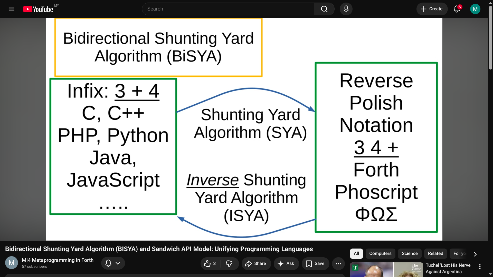

Minimal implementation of Phoscript, typically as a shell function in a host (third generation) programming language, starts with around 20 lines of JavaScript or equivalent (including PHP, Python, Java, C, C++, etc.) It consists of a loop, splitting a space delimited string into tokens, pushing data tokens onto the stack, and calling eval() to execute function tokens, calling function in the host programming language. We believe such minimalist stack machine can be implemented in ANY known programming language.

https://docs.google.com/document/d/1ktZW5yDH-hqTo-XlTJfrg0gQH5gocFjYdFEFI2cJ-k0/edit?tab=t.0

**Phoscript 的最小实现**通常作为宿主（第三代）编程语言中的 shell 函数，始于约 20 行 JavaScript 或等效代码（包括 PHP、Python、Java、C、C++ 等）。它包含一个循环，将空格分隔的字符串分割为标记，将数据标记压入堆栈，并调用 `eval()` 来执行函数标记，即调用宿主编程语言中的函数。我们相信这种极简的栈式机器可以在**任何**已知编程语言中实现。

Phoscript 内核的最基本操作如下:
- A. 包含一个循环，将空格分隔的字符串分割为词元 token，
- B. [函数词元] 如果词元对标宿主语言的函数 (function), 并调用 `eval()` 来执行该函数。
  - [数据词元] 否则, 将该数据词元推送到堆栈顶端。
- C. Phoscript 函数（函数词元） 从堆栈中获取输入，并将输出结果推送回堆栈顶端。

[为了让读者严谨的分析内容, 我们将英文表述列出, 作为对比。]

Phoscript engine works as follow:
- A. It consists of a loop, which splits a space delimited string into tokens.
- B. [function token] if the token maps to a function of the host programming language, it calls eval() to execute the function tokens.
  - [data token] if the token is a data token, then it is pushed onto the the top of the stack.
- C. Phoscript functions or WORDS, take input from the stack and push output results back onto the top of the stack.

以上的仿代码 (pseudocode) 虽然寥寥数行, 但却是自 Dijkstra 迪杰斯特拉 Shunting Yard Algorithm 调度场算法的核心, 用来实现各种程序语言的编译内核。 详情请参考以下视频。

- [Bidirectional Shunting Yard Algorithm (BISYA) and Sandwich API Model: Unifying Programming Languages 双向调度场算法 (BISYA) 与 三明治模式: 统一各种程序语言](https://youtu.be/mYjKS0KiJVg)

 

将数据标记压入堆栈，并调用 `eval()` 来执行函数标记，即调用宿主编程语言中的函数。我们相信这种极简的栈式机器可以在**任何**已知编程语言中实现。

