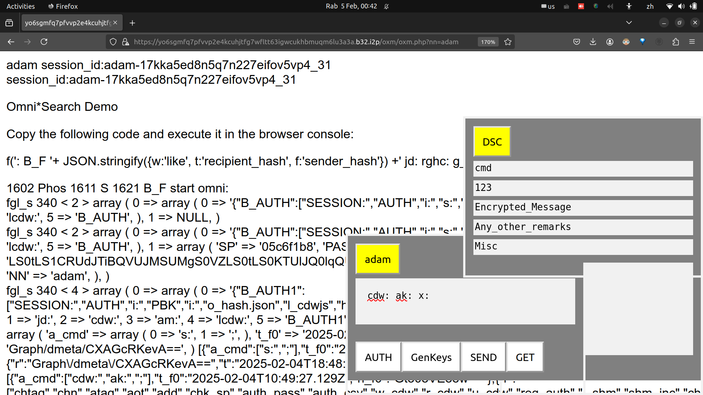

<table><tr>
<td>
<table><tr><td></td><td><h2>Omni*Web + Omni*DOC</h2></td></tr></table> 
</td>
<td>
<table><tr><td>Jekyll Theme Primer</td><td>2</td></tr></table>
</td></tr></table>


## Why Omni*Web?

- *Because MMAGA made USD 1.8 trillion in 2024, but you do not get a dime from their profits.*

If you cannot understand the logic behind the answer given above, then we must congratulate you as you have just found the Red Pill to wake you up from the brainwash imposed on you by the English language mainstream media and education system. (*Monty Python LOL*)

They make so much money using centralized architecture. We do Decentralised architecture.

But should you? Why not?

Analyse default mindset, accept user is slave.

User as Slave Mindset 

User-Slave

and Omni*Web can make you own a piece. 

Because with code, everything is possible.

Propter codice, omnia possibilia sunt.

Reply to comment with article about Omnihash digital assets on GitHub. 


- [Omni*Web Slogan](https://omnixtar.github.io/slogan/)
- [Omni*Web 6 Omni Features](https://omnixtar.github.io/6-omni/)


---

## Omni*Web 6 Omni Features 

With the slogan “Codex Omnia Possibilia”, meaning “with code, everything is possible, Omni*Web aims to build a truly decentralised web ecosystem owned and operated by free individual users and free software programmers. 

The Omnia properties of Omni*Web can be summarised in 6 Omni features:

- Omne corpus 
- Omnipresent
- Omnidata
- Omnilingual
- Omni-environment
- Omnipotent

Omne corpus and omnipresent are the fundamental principles for constructing decentralised systems, which can be implemented on blockchains, secure web infrastructure, or other architectures.

"Omne corpus" means everybody in Latin. It implies Omni*Web employs a hash based decentralised user identifier known as Omnihash which enables every user to have equal access control and rights, replacing the master slave scheme in conventional centralised user management systems. 

"Omnipresent" means Omnihash is used to manage desktop and mobile computing devices connected to Internet using free software decentralised systems such as I2P invisible internet project, so that anyone can connect their computers or mobile devices to the Internet as server for free without Domain Name System AND **make money from sharing computing resources**, from processing power, bandwidth to storage as well as data and source code, from anywhere around the world. 

"Omnidata" means Omnihash user identifier can be extended to all types of digital assets, from the user ID to server address, as well as all types of documents served from the server, from simple text messages to photos and videos.

- Add Contracts and codes as data.


### Contract & Code as Omnidata

One of the most important breakthroughs in Omni*Web is the ability to represent contracts amongst two or more parties as well as computer program source code as data.

- Link to examples, add a short description before link

---

### Codex Omnia Possibilia 
- With code, everything is possible.

The funny thing about Latin slogan is that most commoners are not able to remember the grammar and filler words, and elites will be able to figure them out automatically. So keeping the slogan to minimal significant words with English translation will be good enough to appeal to both types of audience. 

“Codex Omnia Possibilia” simply means “with code, everything is possible”.

Educated elites or pious believers of certain books should be able to recognise the origin of “Omnia possibilia”. 

“Codex” relates to an era when books were made from tree barks and conveys a sense of history on how everything has changed. 

Indeed, books, knowledge and now computer program source code, had been and will be the agent of change for everything. 

Hence the slogan for Omni*Web, 
- Codex Omnia Possibilia. 

---

<!-- 
- ### Omnisophia: Bitcoin + Decentralised AI
- ### *YOUR brain is the weapon .... Omnisophia Metanarchy Revolution.* 
-->
<!-- 


-->

### DJSON: Decentralised JSON

DJSON or Decesntralised JSON is a critical breakthrough by Omni*Web where base 64 hash codes representing any kind of digital assets and entities, from user identifiers to social media actions such as like, comment and share, are embedded in the unassuming ubiquitous JSON strings.

Underlying decentralised JSON is an extension of the Bitcoin address, which is derived from the hash of a public key, to be used as a user identifier. The generalisation of the hash of public key as user identifier is a breakthrough in decentralised computing, as previous frameworks based on blockchains or cryptocurrencies are heavily monopolised by miners.

What makes DJSON so special and powerful is what we call "type preservation property" of hash numbers and integers, which is derived from Ring theory properties of integers, where the operations of additon and multiplication on integers invariably result in integers as output. 

The previous paragraph may sound like your typical high school mathematics nightmare, but it is the biggest secret underlying Bitcoin and other cryptocurrencies as well as novel decentralised social media platforms as we shall see in the following example:

- how to add a like function to **this** GitHub markdown article

We will reveal the answer first and explain later as we assume there are readers who are impatient: 

- ```["2025-02-11T14:25:28.207+0000","like","CXAGcRKevA==","CXAGcRKevA==","HymWBzfj9A==","HymWBzfj9A== s: x:"]```

In the DJSON above, the fields are:

- timestamp, action, current_user_ID, prev_msg_owner, doc_hash, messages

doc_hash means hash of URL of document.

The following are the steps for generating the "like" DJSON of this article, accompanied by a video:

1. Save a copy of this web page as a local file on Omni*Web server.
2. Generate doc_hash for this document.
3. Make a subdirectory for this document with doc_hash.
4. Copy neccessary files and soft links.
5. Open the local copy on [Omni*Web server](https://yo6sgmfq7pfvvp2e4kcuhjtfg7wfltt63igwcukhbmuqm6lu3a3a.b32.i2p/h/E5bnwoBdvg==/?nn=z) using I2P (Invisible Internet Project) and doc_hash.
6. Start Omni*Shell from browser console.
7. Refresh authentication token with user's public key.
8. Send "like" DJSON from browser console using Omni*Shell Phoscript commands.

If the steps above look daunting to you then you will be pleased to know that those are exactly what happen millions of times per seconds around the world when "like" buttons are clicked on social media platforms -- except that YOU, the users and free software programmers, ***do not OWN and OPERATE any part of that, and therefore CANNOT make any money out of it***.

... which brings us to Omni\*Web aim -- to create a truly decentralised web ecosystem, **OWNED and OPERATED by free individual users and free software programmers, capable of providing free alternatives to ALL existing services** provided by the biggest trillion dollar corporations such as MMAGA -- a funny abbreviation for Microsoft, Meta, Amazon, Google and Apple.

---

Omni\*Web will attempt to improve Jekyll's documentation, as we shall do for other free software projects too, 

This article itself will demonstrate several features of Omni*Web aiming at improving Jekyll documentation and promoting it, as well as introduce metaprogramming features that can be used to extend Jekyll's functionalities.

One of Omni*Web most important innovation is Decentralised Full Stack Programming (DFSP).

### Decentralised Full Stack Programming using Hash

Full stack programming has evolved out of the need to coordinate web browser front end and server back end functionalities. Over many years, many frameworks have been developed and front end modules have now included mobile device environments. Their complexities have grown exponentially and we now proposed a decentralised programming paradigm based on hashes, greatly simplifying overall full stack operations. 

To summarise the whole idea before delving into details, we present an example where a user responds to a post with a comment on a GitHub page, where the URL of the original post and the user's comment, as well as the user's identifier are represented by hashes, and these hashes can be hashed using a hash function to produce a root hash, representing the overall transaction. 

The user may submit the transaction JSON and its hash to a server independently operating unrelated to the GitHub page server, as long as it understands and complies with the protocols determined by the hashes. 


A user may claim the same identity with different hash identifiers as long as they can prove the chain of identities by verifying ciphers using the private key for each of the identities. 


#### Jekyll

Jekyll in a nutshell is like a pure front end MVC framework, so that mega websites like GitHub will feel safe to provide pseudo MVC features to its users, in this case, primarily programmers.

Jekyll is the default markdown document parser on GitHub, which is very powerful, but unfortunately has some rather confusing documentation and not so easy to debug.


- cdw: ak: x:
- Enter the above in the nickname (adam) chat box. Click the nickname (adam) button to execute.
- cdw: Read all colon definition words in SESSION()
- ak: array_keys() extract array keys from associative array (JSON like)
- x: sends chat box expressions by AJAX to backend.


---

### Decentralised Monetised Collaboration 

Demon Collab 

Demon’s Con

Omni*DOC

It is interesting how word tricks in English and Latin play out.

The Latin root of “collaborate” is “con” + “laboro”, where “con” is a variation of “cum” meaning “with”.

As such, Decentralised Monetised Collaboration is shortened as “Demon's Con”.

We will tentatively use Demon's Con as the nickname for Decentralised Monetised Collaboration, as we have received feedback that the cryptocurrency industry now has such a bad reputation that we might as well use a Latin word trick to engage users. 

We know some self proclaimed Christians have long associated cryptography with the works of Demons, in folklores like 666. We are interested in engaging in conversation with Christians or any self proclaimed believers in monotheistic religions as we are aware that there are many countries which still practise laws that may prosecute anyone unilaterally as conducting blasphemy, some punishable by death, in 2025 Anno Domino.

However, bringing up Christian demons and 666 also appeals to a large number of fans who are critical of Christian traditions as well as those affected by bad publicity about cryptocurrency and decentralised technologies, bearing in mind that the Washington Wall Street elites prefer to brainwash the American population so that they continue to maintain their monopoly of power in politics and finance. 


Decentralised Monetised Collaboration 

Demon Collab 

Demon’s Con

As the name suggests, Decentralised Monetised Collaboration consists of 3 components: Decentralised infrastructure, Monetisation Legal Framework and Collaborative Transactions.

Collaborative transactions are the most common as they include everything from Google documents to TikTok posts. 

Decentralised infrastructure includes everything from I2P invisible internet project which enables everyone to set up server hosts connected to Internet without the Domain Name System, to Omnihash which is a novel hash algorithm for representing ownership of any kind of digital assets. 

Monetised Legal Framework means employing decentralised hash algorithms to establish digital legal contracts, including loans, payments and investments. 

What can we achieve by combining all 3 components of Decentralisation, Monetisation and Collaboration?

Adding Decentralisation to Collaboration will produce a UNIFIED interface to collaborative transactions. In plain English, it will enable you to combine posts and comments from ALL social media platforms into one integrated platform. 

For example, one of the biggest bottlenecks of chatting with artificial intelligence systems is that the conversation results cannot be automatically published, shared and put into collaboration with other users or AI systems.

With Omni*DOC, where D stands for Decentralisation, O for Oro or gold in Spanish, C for collaboration, a user’s conversation with any AI systems can be republished, shared, commented and so on just like any existing social media posts. 

Omni\*DOC will behave very differently from conventional social media platforms where the operator of the platform will appoint or employ moderators to filter inappropriate speeches. On Omni*DOC however, users themselves may make the decision to choose custom filters to filter out posts or comments that they themselves deem inappropriate. 

Omni*DOC works by first converting any URL into a hash code, which can be anything from 53 bits to 512 bits or longer. 

Secondly, the hash of URL of HURL will be shared amongst servers running Omni*Web modules.

Thirdly, any of Omni*Web servers may decide to create cache copies of a given URL for further processing. 

Up to this stage, Omni\*Web behaves like a Decentralised cache and search network, i.e. instead of a huge centralised search engine operated by one company such as Google or Microsoft, the power of Omni\*Web depends on the number server nodes participating. It basically works like Waybackmachine but its functionalities can be extended by any user or programmers, as long as they conform to Omni*Contract conditions and protocols. 

Social media functionalities exist from step 4 onwards. Although there exist differences amongst social media platforms, different user interface elements are essentially functions which can be represented as paths in graph theory. Further, different paths are represented as hashes, as the ring properties of integers ensure hashes can be concatenated as input to produce an output hash which is also another integer. We may call this property type preservation, namely, the types of inputs and output are preserved. The type preservation property of hashes makes it convenient to manage various types of functions on social media applications. 

First 3 stages, multiply servers. Applying hash in server address.

Stage 4, multiply functionalities. Applying hash in data address. 

In conventional MVC programming, function calls and data types are tightly coupled to types of data and how they are processed. In hash metaprogramming, everything is hash and hashes are compatible with each other due to type preservation property. 

Hash applicable in server and data addresses due to type preservation property. 


### Omni*DOC Example

This document itself is an example of Omni*DOC anyone may comment, share and follow up etc or add functions they wish.

Move this up as it is easiest to understand.

For example, chat results with AI, repost, comments, follow up. 

Demon Collab 

Demon’s Con

demonscon 

links to backend, backend use I2P addresses

- share
- comment
- like
- dislike
- etc.
- clone! novel feature non existant in other social media platforms.

<!--  -->



{{ title }}



[Hello World!][1]
[1]:javascript:alert('Hello World')

[Omni*Web][1]
[1]:javascript:m_oxmobile()

[Hello World](javascript:%28function%28%29%7Balert%28%22Hello%20World%22%29%7D%29%28%29%3B)

[Omni*Web](javascript:%28function%28%29%7Bm_oxmobile%28%29%7D%29%28%29%3B)